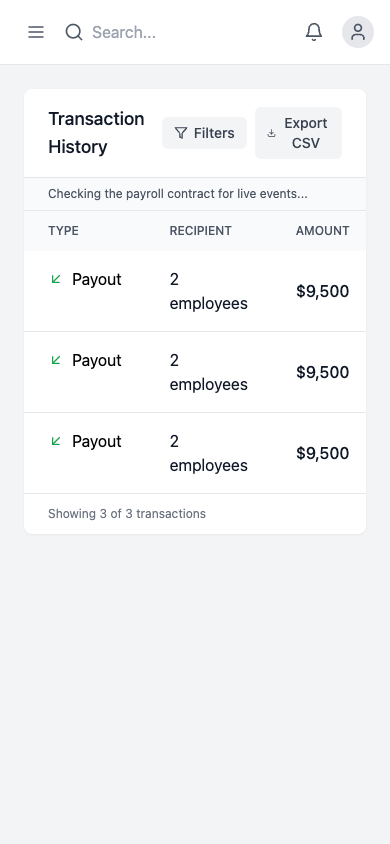
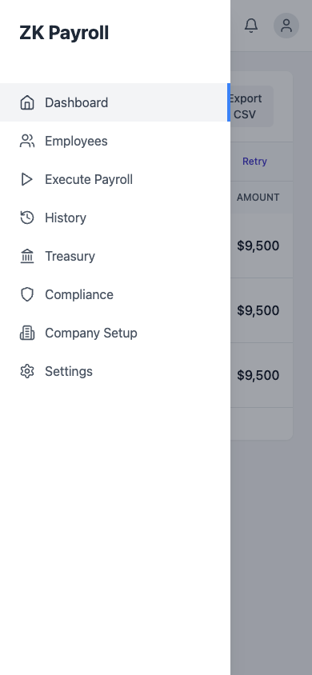
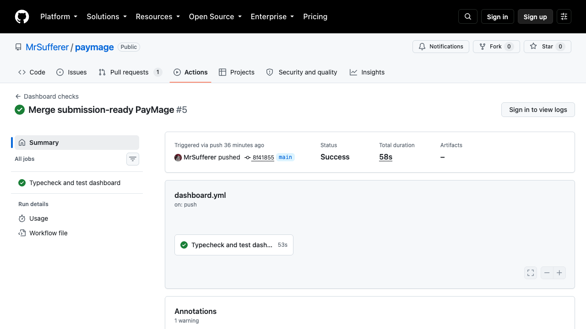
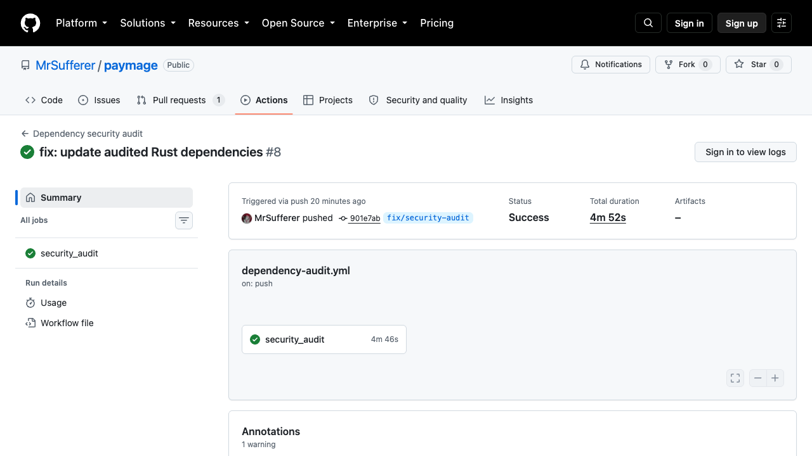
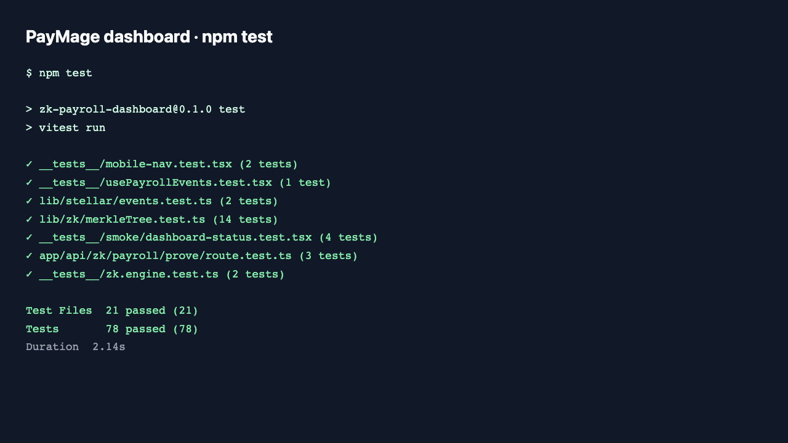

# PayMage

Privacy-first payroll on Stellar Soroban. Employers prove a payroll batch is
valid without exposing individual salaries, then employees withdraw through
zero-knowledge proofs.

**Try it:** [Open the live demo](https://paymage.vercel.app) ·
[Watch the demo video](https://youtu.be/1mcte2MPRvc) ·
[Browse the repository](https://github.com/MrSufferer/paymage)

> PayMage is a Stellar Testnet reference implementation. It is not audited
> and is not intended for production assets.

## Why PayMage exists

Payroll needs a verifiable total without publishing every employee’s salary.
PayMage keeps the payroll total public while commitments, individual salaries,
and employee-to-payment links stay private on-chain.

The system supports an employer workflow and an employee workflow:

1. An employer commits employees to a Poseidon2 Merkle tree and publishes its
   root.
2. The employer generates a Groth16 batch proof. The proof binds the committed
   salaries to the tree, checks their range, and proves their sum.
3. The Payroll contract verifies the proof, checks the budget cap, escrows
   USDC, and records the payroll period.
4. An employee generates a withdrawal proof. The contract checks the Merkle
   membership and nullifier, then releases the employee’s USDC.

## Quick start

Run the dashboard locally with Node.js 20 or later:

```bash
git clone https://github.com/MrSufferer/paymage.git
cd paymage/zk-payroll-dashboard
npm ci
cp .env.example .env.local
npm run dev
```

The example environment targets Stellar Testnet and includes the recorded
PayMage contract addresses. Set `SESSION_SECRET` to a value with at least 32
characters before using server-backed authentication.

## Use the dashboard

Open the local dashboard, connect Freighter on Stellar Testnet, and follow the
payroll flow:

- Add employees and build the commitment tree
- Review and submit a payroll batch
- Watch verification and withdrawal events in History
- Manage encrypted compliance view keys when the workflow requires them

The hosted demo is the best way to review the product flow. The local dashboard
also includes a mock ZK engine for UI development. A real testnet transaction
requires a configured prover and wallet.

## Architecture

PayMage separates circuit constraints, Soroban state transitions, proof
generation, and the operator dashboard:

| Layer | Location | Responsibility |
| --- | --- | --- |
| Circuits | `circuits/` | Payroll batch and withdrawal constraints using Circom, Groth16, and Poseidon2 |
| Contracts | `contracts/payroll/` | Proof verification, budget caps, nullifiers, USDC escrow, TTL, and events |
| Verifiers | `contracts/circom-groth16-verifier/` | BN254 Groth16 verification on Soroban |
| Prover | `app/crates/payroll-prover/` | Native and WebAssembly proof generation bindings |
| Dashboard | `zk-payroll-dashboard/` | Next.js UI, Freighter integration, transaction flow, event polling, and tests |
| Deployment | `deployments/` | Testnet addresses and the payroll deployment script |

For the detailed circuit and contract design, read
[`docs/dorahack-submission.md`](docs/dorahack-submission.md).

## Submission checklist

The following links collect the public evidence for the submission:

- [x] [Public GitHub repository](https://github.com/MrSufferer/paymage)
- [x] [Live demo](https://paymage.vercel.app)
- [x] [Demo video](https://youtu.be/1mcte2MPRvc)
- [x] [Testnet contract addresses](#testnet-deployment)
- [x] [Recorded interaction transactions](#recorded-testnet-interactions)
- [x] [Mobile dashboard screenshot](docs/screenshots/mobile-ui.png)
- [x] [Mobile navigation screenshot](docs/screenshots/mobile-nav-open.png)
- [x] [Dashboard CI screenshot](docs/screenshots/ci-pipeline.png)
- [x] [Dependency audit screenshot](docs/screenshots/ci-security-audit.png)
- [x] [Passing test output](docs/screenshots/tests-passing.png)
- [x] [DoraHack submission details](docs/dorahack-submission.md)

## Testnet deployment

PayMage’s recorded deployment targets Stellar Testnet:

| Contract | Address |
| --- | --- |
| Payroll | `CDSODUB6ZYOB5VZ4GV6MD2NAZ3RA3KZ73RVOBNZMFVXOO7CLLYWTUXNF` |
| Payroll verifier | `CCSE6A4JH4KDWE63XMJ62LZBJTKJY4AEY3Q6FIACTKXZMNAX2NA7HRI6` |
| Withdraw verifier | `CCARTGQLYGE2TCFFGPNC2B4IXUZJV4Y5QZWNHX4CXEREDLVIB3XYY5DH` |
| Token SAC | `CDLZFC3SYJYDZT7K67VZ75HPJVIEUVNIXF47ZG2FB2RMQQVU2HHGCYSC` |

The deployment metadata lives in
[`deployments/testnet/deployments.json`](deployments/testnet/deployments.json),
and the deployment command lives in
[`deployments/scripts/deploy-payroll.sh`](deployments/scripts/deploy-payroll.sh).

## Recorded testnet interactions

These links show the two recorded contract interactions in Stellar Expert:

- [`run_payroll` transaction](https://stellar.expert/explorer/testnet/tx/a27afe6f0bd9ef54cb3dc81658d3965b8e7d8e9f7b8a21e7146941e0cec60993)
- [`withdraw` transaction](https://stellar.expert/explorer/testnet/tx/a511f27bc833e32e6ce252d5ac83b7695ca189207114a6698a5737de5ee68ddb)

## Screenshots

The screenshots show the current dashboard shell, mobile navigation, local
tests, and public GitHub Actions runs:

| Evidence | Preview |
| --- | --- |
| Mobile History at 390 × 844 | [](docs/screenshots/mobile-ui.png) |
| Mobile drawer with dashboard routes | [](docs/screenshots/mobile-nav-open.png) |
| Dashboard checks | [](https://github.com/MrSufferer/paymage/actions/runs/33378719505) |
| Dependency security audit | [](https://github.com/MrSufferer/paymage/actions/runs/33379942151) |
| Dashboard tests | [](docs/screenshots/tests-passing.png) |

## Testing and CI

Run the dashboard checks from its directory:

```bash
cd zk-payroll-dashboard
npm run typecheck
npm test
```

Run the Rust payroll contract tests and dependency check from the repository
root:

```bash
cargo test -p payroll
cargo shear
```

GitHub Actions runs dashboard typechecks and tests through
[`dashboard.yml`](.github/workflows/dashboard.yml). Rust builds, contract
builds, WebAssembly checks, dependency audits, and coverage use the workflows
in [`.github/workflows/`](.github/workflows/).

## Development and deployment

Use `NEXT_PUBLIC_ZK_ENGINE=mock` for dashboard-only work. Use the `server`
engine with `PAYROLL_PROVER_URL` for the server-backed proving flow. The
`real` engine requires generated proving artifacts, which are intentionally
excluded from Git.

Build the Rust workspace with Cargo. Build or deploy the testnet contracts with
the scripts under [`deployments/scripts/`](deployments/scripts/).

## Lifecycle documentation

The canonical feature records are grouped under
[`docs/ai/requirements/`](docs/ai/requirements/),
[`docs/ai/design/`](docs/ai/design/),
[`docs/ai/planning/`](docs/ai/planning/),
[`docs/ai/implementation/`](docs/ai/implementation/),
[`docs/ai/testing/`](docs/ai/testing/), and
[`docs/ai/review/`](docs/ai/review/).

## Security and limitations

PayMage documents its current trade-offs explicitly:

- `salaryAmount` is a public circuit input during withdrawal so the contract
  can transfer the requested amount. Full amount privacy remains future work.
- `PAYROLL_PROVER_URL` is demo infrastructure. Production use needs durable
  hosting, authentication, and operational controls.
- The contracts target Stellar Testnet and have not received a security audit.
- Large proving keys are intentionally gitignored and are not committed.

## Status

PayMage is a working Testnet reference implementation with a deployed payroll
flow, browser and server proving paths, dashboard tests, and recorded
`run_payroll` and `withdraw` interactions. Treat the current deployment as a
reviewable demo, not a production payroll service.

## License

See the repository [LICENSE](LICENSE) file.
