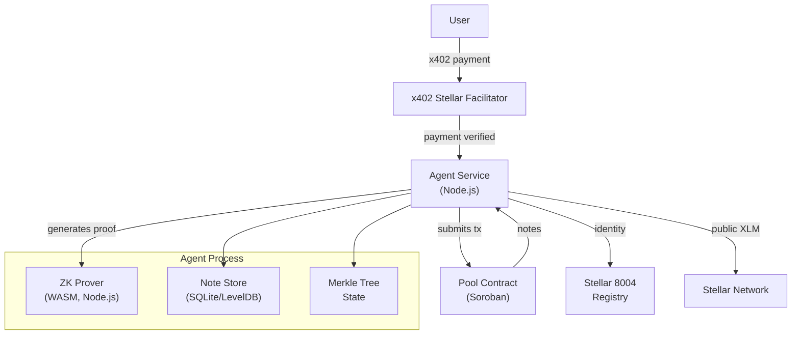

# System Design & Architecture

## Architecture Overview



**Components:**

| Component | Responsibility | Reuse/Build |
|-----------|---------------|-------------|
| x402 Stellar Facilitator | Verifies x402 payments, notifies agent | Existing (`x402-stellar/examples/facilitator/`) |
| Agent Service | Orchestrates deposit/withdraw flows, manages note lifecycle | **New** — `x402-agent-privacy-pool/agent/` |
| ZK Prover | Generates Groth16 proofs for deposit/transfer/withdraw | Reuse `app/crates/core/prover/` (WASM for Node.js) |
| Note Store | Persists note secrets, commitments, nullifiers, Merkle tree state | **New** — SQLite or LevelDB |
| Pool Contract | Verifies ZK proofs, manages note commitments, per-agent Merkle roots | Modify `contracts/pool/` |
| Stellar 8004 | On-chain agent identity registration | External (`stellar8004.com`) |

**Technology stack**: Node.js (agent service), Rust (prover, compiled to WASM), Soroban (pool contract), TypeScript (x402 integration)

## Data Models

### Note
```typescript
interface Note {
  secret: Uint8Array;          // 32-byte random, generated by agent
  commitment: Uint8Array;      // Poseidon2(note secret, value, agent_id) — hash binds agent
  nullifier: Uint8Array;       // Poseidon2(note secret) — used to prove unspent
  value: bigint;               // Note denomination in stroops
  agentId: string;             // Agent's Stellar pubkey (base58) — bound into commitment
  treePosition: number;        // Index in the shared pool Merkle tree (from on-chain event)
  spent: boolean;
  createdAt: number;           // Unix timestamp
}
```

### Agent State
```typescript
interface AgentState {
  stellarPubkey: string;           // Agent's Stellar address
  latestPoolRoot: Uint8Array;      // Latest known root from pool contract events
  merkleTreeDepth: number;         // Tree depth (e.g., 16, from contract)
  unspentNotes: Note[];            // Notes not yet spent (local tracking)
  privateBalance: bigint;          // Sum of unspent note values
  feeBasisPoints: number;          // Agent's fee (e.g., 100 = 1%)
  lastProcessedPayment: string;    // Last x402 payment tx hash (idempotency)
  poolTokenBalance: bigint;        // Agent's token balance held in pool contract
}
```

### Pool Contract Storage (per-agent tracking)
```rust
// Off-chain only — contract does not enforce per-agent state
struct AgentRoot {
    agent: Address,        // Agent's Stellar address
    root: Uint256,         // Agent's latest known root (from events)
    depth: u32,            // Tree depth (constant, from contract)
}
```

## API Design

### Agent → Pool Contract (Soroban XDR)

**`deposit(proof, commitment, root)`**
- Input: Groth16 proof, note commitment, Merkle root
- Verifies: proof is valid, commitment is in tree at root, note not already spent
- Effect: records commitment in agent's Merkle tree, updates root

**`withdraw(proof, nullifier, recipient, fee)`**
- Input: Groth16 proof, nullifier, recipient address, agent fee recipient
- Verifies: proof valid, nullifier not spent, recipient authorized
- Effect: marks note as spent, transfers public balance to recipient

**`transfer(proof, input_nullifier, output_commitment, new_root)`**
- Input: Groth16 proof, input note nullifier, new note commitment, new Merkle root
- Verifies: input note unspent, proof valid, new commitment in new tree
- Effect: consumes input note, adds output commitment to tree

### x402 Webhook → Agent

Agent listens for payment notifications from facilitator. Notification format:
```typescript
interface PaymentNotification {
  txHash: string;           // Stellar payment tx hash
  amount: string;           // Amount in XLM (string to avoid precision loss)
  fee: string;              // x402 facilitator fee
  from: string;             // Payer's Stellar address
  timestamp: number;
}
```

Agent responds with:
```typescript
interface DepositResult {
  success: boolean;
  noteCommitment?: string;  // Base64 commitment if deposit succeeded
  error?: string;
}
```

### Agent Configuration (env vars)
```
AGENT_STELLAR_SECRET_KEY=S...
AGENT_FEE_BASIS_POINTS=100        # 1% fee
FACILITATOR_URL=https://facilitator.example.com
FACILITATOR_API_KEY=...
STELLAR_NETWORK=testnet           # or mainnet
POOL_CONTRACT_ID=CDMLE...
AGENT_DATA_DIR=./agent-data       # SQLite + Merkle tree state
```

## Component Breakdown

### 1. Agent Service (`agent/`)
Entry point. Orchestrates the full flow:
- Subscribes to Stellar RPC events for incoming payments to agent's address (G4 resolution)
- On payment detected: query facilitator `/verify` to confirm payment is valid x402 payment
- Then: idempotency check, generate note, call prover, submit to pool
- Maintains note store and pool root tracking
- Exposes admin API: `/balance`, `/notes`, `/status`
- Registers with Stellar 8004 Identity Registry at startup via `@trionlabs/8004-sdk`

### 2. ZK Prover (WASM)
Reuses `app/crates/core/prover/`. Compiled to WASM via `wasm-pack build --target nodejs`.
- `generate_deposit_proof(note_secret, value, agent_id, merkle_proof, tree_root)`
- `generate_withdraw_proof(note_secret, value, agent_id, recipient, merkle_proof, tree_root)`
- `generate_transfer_proof(input_note, output_note, merkle_proof, tree_root)`

Circom circuit: `policyTransaction.circom` (already exists, handles deposit/transfer/withdraw).

### 3. Note Store
SQLite schema:
```sql
CREATE TABLE notes (
  secret TEXT PRIMARY KEY,       -- Base64 encoded
  commitment TEXT UNIQUE NOT NULL,
  nullifier TEXT UNIQUE NOT NULL,
  value TEXT NOT NULL,           -- String representation of bigint
  agent_id TEXT NOT NULL,
  tree_position INTEGER NOT NULL, -- Position in shared pool tree (from event)
  spent INTEGER DEFAULT 0,
  created_at INTEGER NOT NULL
);

CREATE TABLE pool_state (
  agent_id TEXT PRIMARY KEY,
  latest_root TEXT NOT NULL,
  depth INTEGER NOT NULL
);

CREATE TABLE processed_payments (
  tx_hash TEXT PRIMARY KEY,
  processed_at INTEGER NOT NULL,
  amount TEXT NOT NULL
);
```

### 4. Pool Contract Modifications
Existing `contracts/pool/` needs minimal changes:

**Token integration** (G1/G2 resolution):
- Pool uses `TokenClient` (Soroban classic token, not native XLM directly)
- Agent deposits XLM by calling `token.transfer(agent, pool, amount)` then `transact()`
- For withdrawals: pool holds token balance, transfers to agent's wallet via `token.transfer(pool, agent, amount)`
- **Important**: pool must be funded with the token before withdrawals can happen. Agent funds pool by depositing more than it withdraws.

**New storage and getters**:
- `AgentRoots` map: `Address → Uint256` — off-chain tracking only
- `get_agent_root(agent: Address) → Uint256` — public getter for coordination

**No changes to `transact` entry point or nullifier registry** — circuit already binds agent ID into commitments.

**Single shared Merkle tree** — all agents' commitments go into the same `MerkleTreeWithHistory`. Isolation enforced by circuit.

### 5. Stellar 8004 Integration (G5 — DEFERRED to v2)
Agent identity in v1: agent's Stellar pubkey directly. No registry.
- Stellar 8004 website (stellar8004.com) returns 404 — API not accessible
- v2 will integrate when API is documented and accessible
- Agent identity = Stellar `Address` used for all pool transactions

## Design Decisions

**DD1: Agent generates its own note secrets**
- Trade-off: agent has full control over notes. Correct for agentic model.
- Alternative: user generates secrets → breaks autonomy.
- Decision: agent generates secrets internally. No external secret exposure.

**DD2: WASM prover as Node.js module (not separate process)**
- Trade-off: simpler deployment vs. stronger isolation.
- Alternative: separate prover process with IPC → more isolation, more complexity.
- Decision: start with inline WASM module. Add process isolation in v2 if threat model requires.

**DD3: SQLite for note store (not in-memory)**
- Trade-off: persistence vs. complexity.
- Alternative: in-memory only → losing agent process = losing all notes + secrets = funds lost.
- Decision: SQLite. Agent can restart without losing note state.

**DD4: Single shared Merkle tree, circuit-level agent isolation**
- The pool contract has ONE shared Merkle tree for all commitments. No per-agent tree partitioning at contract level.
- Agent isolation comes from circuit: `Poseidon2(note secret, value, agent_id)` binds agent ID into the commitment. Agent A cannot construct a valid proof for agent B's notes.
- Pool contract modifications needed: `AgentRoots` map (off-chain tracking only, not enforced by contract), `get_agent_root(agent)` public getter. No changes to `transact` entry point or nullifier registry.
- All agents' commitments visible on-chain in the same tree. This is acceptable: commitments are hashes, not plaintext. Observers can see that *someone* deposited but not *who*.
- Pro: minimal contract changes, circuit already handles agent isolation
- Con: agents share nullifier namespace (but circuit prevents cross-agent spending)

**DD5: x402 facilitator as separate service (not built into agent)**
- Trade-off: complexity vs. reusability.
- Existing `x402-stellar/examples/facilitator/` handles Stellar payment verification.
- Agent just subscribes to webhook notifications.
- Decision: reuse existing facilitator. Agent is x402 client.

**DD6: Pool circuit agnostic to x402 payment types**
- x402 supports: one-time payments, streaming, micro-payments, subscriptions, rate-limiting.
- Each would require a different ZK circuit constraint system — not scalable.
- Alternative: narrow to deposit/withdraw/transfer only (existing `policyTransaction.circom`).
- How x402 types map to our model without circuit changes:

| x402 type | How agent handles it |
|-----------|---------------------|
| One-time payment | Direct deposit to pool |
| Streaming | Agent accumulates in public wallet, batch deposits at intervals (e.g., hourly) |
| Micro-payment | Same as streaming — settle in batches |
| Subscription | Recurring draws from facilitator into agent's public wallet, agent batch-deposits |
| Rate-limiting | Enforced by x402 facilitator (not our concern) |

- The pool circuit only needs to prove: note exists, not double-spent, value conserved, authorized.
- It doesn't care how the agent received the public funds.
- Privacy is on the *pool side* (breaking deposit/withdrawal link), not the x402 settlement side.
- **v1 scope**: deposit/withdraw/transfer only. Other x402 types handled via batching.

**DD7: Agent deposits to pool on its own schedule, not per-payment**
- Agent receives x402 payments into public wallet. When to deposit to pool?
- Option A: deposit immediately on each payment → fine-grained privacy, more proof overhead
- Option B: batch accumulate, deposit periodically → fewer proofs, same privacy outcome for final withdrawal
- Decision: agent deposits on its own schedule (configurable: per-payment, hourly, daily). Simpler code, agent controls cost.

**DD8: Micro-payment handling**
- Pool has minimum note denomination (circuit constraint, e.g., 0.1 XLM equivalent)
- Micro-payments below min accumulate in agent's public wallet until batch reaches min
- Privacy during accumulation: NOT private (funds sit in agent's public wallet). Trade-off accepted for v1.
- Statistical detection risk: 1000 users pay 0.001 XLM each → agent deposits 1 XLM note → link not broken, just delayed
- Mitigation: agent periodically performs internal transfer operations between own notes to break aggregation heuristics
- v2 could add separate micro-denomination pool if demand justifies added complexity

**DD9: Payment notification via Stellar RPC subscription (G4 resolution)**
- x402 facilitator has NO webhook or push notifications
- Agent subscribes to Stellar RPC events for incoming payments to its address
- When payment detected: agent confirms via facilitator `/verify`, then deposits to pool
- Alternative considered: wrap facilitator with custom webhook → extra complexity, not needed for v1
- Alternative considered: agent acts as x402 resource server receiving client resubmission → breaks the model (agent is the payer, not the server)

**DD10: Agent identity via Stellar 8004 (G5 resolution — corrected)**
- Stellar 8004 is real, contracts deployed on testnet/mainnet. SDK: `@trionlabs/8004-sdk`.
- Contracts: Identity Registry (agent NFTs), Reputation Registry (feedback scores), Validation Registry (attestations)
- Testnet contract IDs: Identity `CDE3K4COIAGWNNJQQLL26SYI3KBJF5FUDHXG5FA6GYDJCG7T5V7FIWZH`, Reputation `CBZEAGIEI3HXMDRLF44KLQJQQOH6LCYWWSGJVSYQYQO2HQ6DDGZ7HT55`
- Agent registers via SDK: `8004Client.identity.register()` → gets agent NFT
- Agent sets `agentURI` pointing to JSON with capabilities/endpoints
- v1 scope: registration + identity only. Reputation/validation deferred.
- Agent uses same keypair for: receiving x402 payments, 8004 registration, pool tx signing

## Non-Functional Requirements

**Performance**:
- ZK proof generation: <5s for standard notes on commodity hardware
- Payment-to-deposit latency: <60s from facilitator notification to on-chain confirmation
- Agent can handle concurrent payments sequentially (one tx at a time per agent, ~10 TPS)

**Scalability**:
- Horizontal scaling: multiple agent instances with disjoint note sets (each agent = separate identity)
- Vertical scaling: faster prover hardware = faster proof generation
- Note: more notes = larger Merkle tree = longer proof times (tree depth bounded at 16-20)

**Security**:
- Note secrets stored in SQLite (at rest encryption recommended in production)
- Agent secret key in env var or HSM (not in code)
- Merkle tree state backed up alongside note store
- Circuit prevents double-spending via nullifier check
- Agent ID bound into circuit public inputs prevents cross-agent note theft

**Reliability**:
- Idempotency on payment notifications (dedup by tx hash)
- Note store is source of truth for note state — pool contract is downstream
- If pool tx fails, note store should not be updated (atomic pattern)

**Privacy**:
- Circuit hides sender/recipient linkage within agent's own notes
- Cross-agent privacy handled by circuit (no cross-agent proof verification possible without agent ID binding)
- Nullifier set is shared but agents can't enumerate other agents' nullifiers (contract doesn't expose enumeration API)
- Pool circuit is agnostic to x402 payment types. Streaming/subscription payments are private on the pool side once deposited.
- **Micro-payment privacy gap**: small payments accumulate in agent's public wallet before batching — not private during accumulation. Internal mixing transfers reduce statistical detection risk but don't eliminate it.