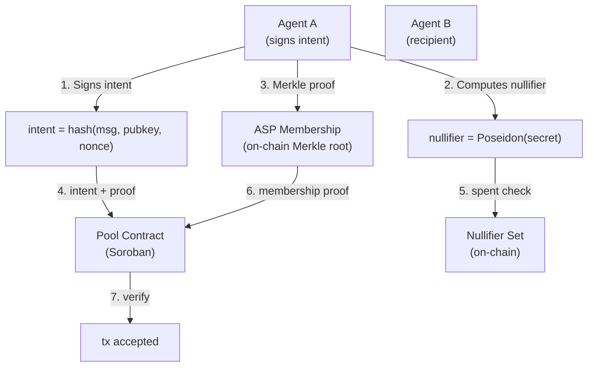

# System Design & Architecture

## Architecture Overview



**Key difference from prior approach**:
- No cryptographic signatures — only Poseidon hash commitment + dual Merkle proofs
- Nullifier = Poseidon(secretKey) serves as BOTH the identity pseudonymous identifier AND the ASP Merkle leaf
- Proving ASP membership and nullifier unspent simultaneously = prove Poseidon(secretKey) is in both trees
- Groth16 still used for proof generation (Lemma oracle WASM prover), but circuit is simpler than full transaction proof
- No trusted setup ceremony — transparent verification
- ASP membership is **publicly verifiable** (root on-chain) but **agent identity private**

## Components

### CompliantIntent.circom (new circuit)

No Groth16. Only:
1. **Signature verification**: Ed25519 or ECDSA — verify intent message signed by secret key holder
2. **Poseidon hash**: Compute nullifier from secret key
3. **Dual Merkle proofs**: ASP membership + nullifier unspent

```
CompliantIntent(levels) {
    // PUBLIC INPUTS
    input aspRoot;           // On-chain ASP Merkle root (public, auditable)
    input nullifierRoot;     // Current nullifier set root (public)
    input intentHash;        // hash(intent_message, public_key, nonce)
    input poolRoot;          // Current note commitment root

    // PRIVATE INPUTS
    input secretKey;         // Agent's secret key (never revealed)
    input publicKey;         // Agent's public key (identity pseudonymous)
    input nonce;             // Intent nonce (prevents replay)
    input intentMessage;     // Human-readable intent string
    input membershipPathElements[levels];
    input membershipPathIndices[levels];
    input nullifierPathElements[levels];
    input nullifierPathIndices[levels];

    // CONSTRAINTS

    // 1. Verify signature
    //    eddsa_verify(publicKey, intentMessage || nonce, signature) → 1
    //    This binds secretKey to publicKey without revealing secretKey

    // 2. Compute nullifier = Poseidon(secretKey)
    //    nullifier_output === Poseidon(secretKey)
    //    This is the public identifier for this agent's intent

    // 3. Verify intent hash matches
    //    intentHash === hash(intentMessage, publicKey, nonce)
    //    This prevents tampering with intent

    // 4. Verify ASP membership (Merkle proof)
    //    leaf = Poseidon(publicKey) // public key in ASP tree
    //    merkle_verify(leaf, path) === aspRoot

    // 5. Verify nullifier not spent (Merkle proof)
    //    merkle_verify(nullifier, nullifier_path) === nullifierRoot
    //    If nullifier is in set, this fails → double-spend prevented
}
```

### Pool Contract (modify existing)

Existing `contracts/pool/` handles note commitments. Add:
- `aspRoot` — reference to ASP membership contract root
- `nullifierRoot` — tracks spent nullifiers
- `verify_intent(intentHash, aspProof, nullifierProof)` — verifies the intent circuit outputs
- Balance conservation: input notes value = output notes value

### ASP Membership Contract (reuse existing)

Existing `contracts/asp-membership/`. No changes needed. Pool contract reads `aspRoot` from it.

### Agent SDK (extend trust402)

Existing `@trust402/identity` handles keypair generation. Extend to:
- `signIntent(message, nonce)` → `intentHash + signature`
- `generateNullifier(secretKey)` → `Poseidon(secretKey)`
- `generateMerkleProof(key)` → `membershipPathElements, membershipPathIndices`
- `submit(pool, intent, nullifierProof, aspProof)` → pool transaction

## Data Models

### Intent Message
```
IntentMessage {
    message: string,       // "Transfer 100 USDC to GXXXX... for service X"
    publicKey: string,    // Agent's public key (pseudonymous identity)
    nonce: u64,           // Monotonic counter — prevents replay
    timestamp: u64,       // Unix timestamp — intent expires after T
}
```

### IntentProof (submitted to pool)
```
IntentProof {
    intentHash: Uint256,       // hash(message, publicKey, nonce)
    signature: Uint8Array,      // ed25519/ECDSA signature over intentHash
    nullifier: Uint256,         // Poseidon(secretKey) — public identifier
    aspProof: MerkleProof,     // Proves publicKey is in ASP Merkle tree
    nullifierProof: MerkleProof, // Proves nullifier not in spent set
    inputNotes: Note[],         // Notes being consumed
    outputNotes: Note[],        // Notes being created
}
```

### Note (from existing pool)
```
Note {
    secret: Uint8Array,       // Known only to owner
    commitment: Uint256,      // Poseidon(amount, publicKey, blinding)
    nullifier: Uint256,       // Poseidon(secret)
    amount: u64,
    blinding: Uint8Array,
}
```

## Design Decisions

| Decision | Choice | Rationale |
|----------|--------|-----------|
| Signature scheme | Ed25519 | Fast, widely supported, small signatures |
| Nullifier | Poseidon(secretKey) | ZK-friendly hash, binds to secret without revealing it |
| Membership proof | Merkle proof against on-chain ASP root | Public compliance, private identity |
| Intent hash | hash(message, publicKey, nonce) | Prevents tampering, replayable but not reusable |
| Proof generation | Local only | Agent's secret never sent anywhere |
| Verification | On-chain (pool contract) | Trustless — no trusted third party |

## Why This Works

1. **Compliance**: ASP root is public and auditable. Only authorized agents can transact.
2. **Privacy**: Agent's public key is in the ASP Merkle tree — nobody knows which member.
3. **Liveness**: Nullifier = Poseidon(secretKey). Spending the same intent twice = double-spend detected.
4. **No identity**: Nullifier reveals nothing about the agent. It's a pseudonym tied to the secret key.
5. **No Groth16**: Signature + Merkle proofs = <1s generation, no trusted setup.

## Non-Functional Requirements

- **Intent generation time**: <100ms (signature + hash)
- **Merkle proof generation**: <500ms (depth ~20, Poseidon hashing)
- **Pool verification**: <5s (Soroban transaction)
- **Privacy**: No on-chain data reveals agent identity, amount, or counterparty (only: intent hash + nullifier)
- **Finality**: Immediate after pool tx confirmed on Stellar
