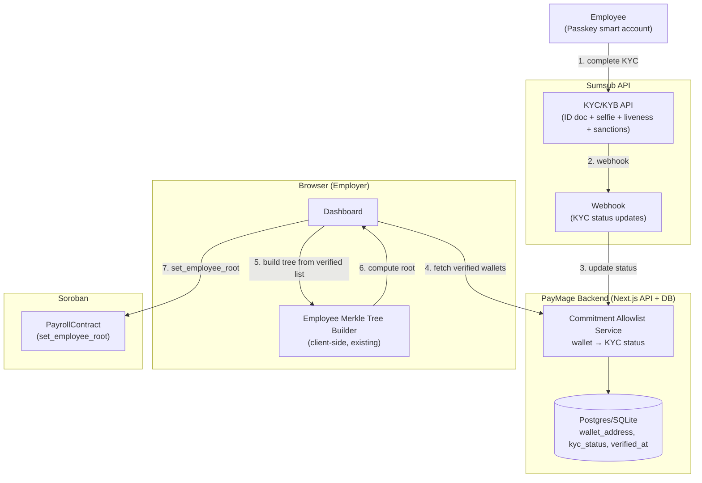
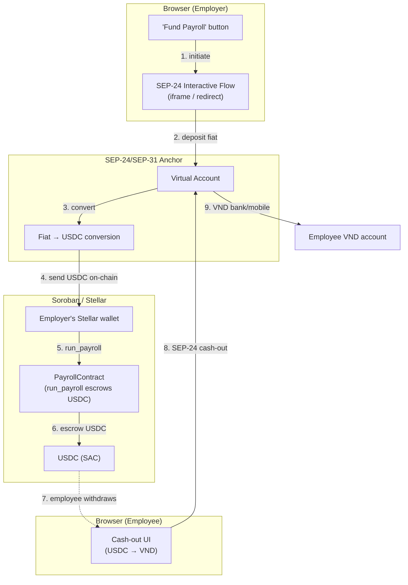
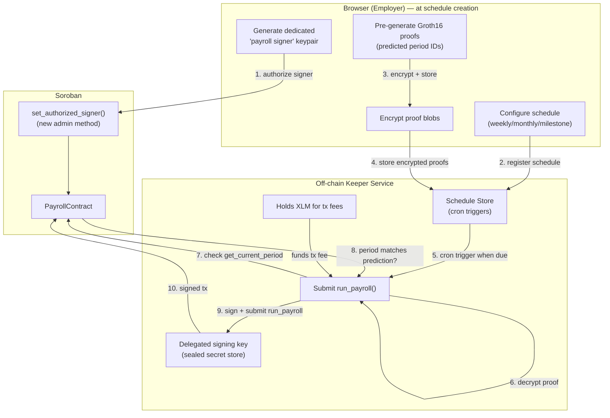
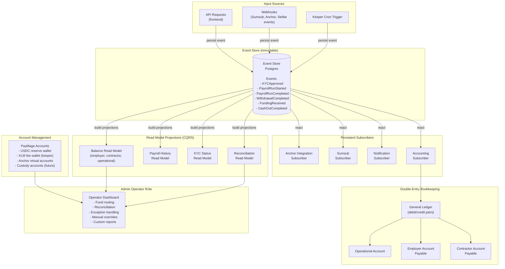

# System Design & Architecture

> **Design review 2026-07-03**: Resolved 8 open questions. Key decisions: standalone payroll (not pool-integrated), PayrollWithdrawCircuit for ZK withdrawals, proof-bound amounts, X25519-XSalsa20-Poly1305 encryption, __constructor migration, circuit bug fixes.
>
> **Design review 2026-07-06**: Synced ZK-layer doc to implementation (withdraw API, nullifier pattern, DataKey enum, events). Extended design to cover SCF Build grant-funded features: KYC (Sumsub + off-chain allowlist), fiat on-ramp (SEP-24/SEP-31 anchors), and payroll automation (off-chain keeper with delegated signer + pre-generated encrypted proofs).

## Architecture Overview

```mermaid
graph TD
    subgraph Browser_Employer["Browser (Employer)"]
        UI["PayrollWizard / ComplianceManager"]
        ZK["ZK Engine (ark-circom WASM)"]
        MB["Employee Merkle Tree Builder"]
        ENC["X25519-XSalsa20-Poly1305 Encryptor"]
        IPFS_UPLOAD["uploadToIPFS()"]
    end

    UI -->|1. configure payroll| MB
    MB -->|2. build tree, compute root| ZK
    UI -->|3. generate proof| ZK
    ZK -->|4. encrypt blobs| ENC
    ENC -->|5. upload to IPFS| IPFS_UPLOAD
    IPFS_UPLOAD -->|6. get CIDs| UI
    UI -->|7. submit tx with CIDs| RPC["Soroban RPC"]
    RPC -->|8. verifyProof| PayrollContract["PayrollContract"]
    PayrollContract -->|9. call| Verifier["circom-groth16-verifier"]
    Verifier -->|10. BN254 pairing| PayrollContract
    PayrollContract -->|11. transfer USDC to escrow| Token["USDC Token (SAC)"]
    RPC -->|12. events| UI

    subgraph IPFS["IPFS (off-chain blob storage)"]
        IPFS_NODE["Encrypted salary blobs\n(employeeId || salaryAmount || salt)\nencrypted with X25519-XSalsa20-Poly1305"]
    end

    IPFS_UPLOAD -->|13. store blob| IPFS_NODE
    IPFS_NODE -.->|14. retrieve by CID| AuditorBrowser["Browser (Auditor)"]

    subgraph AuditorBrowser["Browser (Auditor)"]
        AUD["Audit UI"]
        DEC["X25519-XSalsa20-Poly1305 Decryptor"]
        GET_CID["getPayrollPeriod(periodId)\n→ get ipfsCids"]
    end

    AuditorBrowser -->|15. get CIDs from contract| PayrollContract
    GET_CID -->|16. fetch from IPFS| IPFS_NODE
    IPFS_NODE -->|17. encrypted blob| DEC
    DEC -->|18. (employeeId, salaryAmount)| AUD

    subgraph Browser_Employee["Browser (Employee)"]
        EMP_UI["Employee Withdrawal UI"]
        EMP_ZK["ZK Engine (withdraw prover)"]
        EMP_ENC["X25519-XSalsa20-Poly1305 Decryptor"]
    end

    EMP_UI -->|19. get commitment data| EmployerRegistry["Off-chain registry\n(employee → commitmentId, salt)"]
    EMP_UI -->|20. decrypt own data| EMP_ENC
    EMP_ENC -->|21. generate withdraw proof| EMP_ZK
    EMP_ZK -->|22. submit withdraw()| RPC
    RPC -->|23. verifyProof| PayrollContract
    PayrollContract -->|24. transfer USDC to employee| Token
```

**Technology stack:**
- **ZK proving**: Groth16 via `ark-circom` compiled to WASM — browser-native, no external prover
- **Hash function**: Poseidon2 (BN254) inside circuit — same as privacy pool
- **Encryption**: X25519-XSalsa20-Poly1305 for off-chain salary blobs (IPFS) — same pattern as pool's per-note encryption; auditor decrypts with their X25519 private key
- **Contract**: Soroban Rust — same network as privacy pool, reuses `circom-groth16-verifier` contract
- **Token**: USDC via Soroban Token (SAC interface)
- **Frontend**: Next.js 14 — existing zk-payroll-dashboard
- **Blob storage**: IPFS (off-chain) — encrypted blobs never touch the contract

**How it fits with existing codebase:**
- `contracts/circom-groth16-verifier/` — reused as-is for both payroll deposit and withdrawal proof verification
- `circuits/src/` — `payroll.circom` (deposit) + `payrollWithdraw.circom` (Phase 2 withdrawal) added here
- `contracts/payroll/` — standalone payroll contract (own escrow, own withdrawal)
- `contracts/pool/` — not used (standalone payroll architecture)
- `circuits/src/merkleProof.circom` — reused by both payroll and withdrawal circuits
- `circuits/src/poseidon2/` — shared Poseidon2 hash implementation

## Data Models

### On-Chain

```rust
// PayrollContract storage keys (DataKey enum)
enum DataKey {
    Admin,                    // Address
    Token,                    // Address (USDC SAC)
    Verifier,                 // Address (circom-groth16-verifier for PayrollBatch)
    EmployeeRoot,             // U256
    BudgetCap,                // U256
    CurrentPeriod,            // u64
    Period(u64),              // PayrollPeriod
    PeriodCommitments(u64),   // Vec<U256> (commitment IDs for the period)
    CommitmentRecord(U256),   // CommitmentRecord (commitment_id → IPFS CID)
    Auditor(Address),         // AuditorRecord
    WithdrawVerifier,         // Address (circom-groth16-verifier for PayrollWithdraw)
    WithdrawnNullifier(U256), // bool — tracks spent nullifiers (Tornado Cash pattern)
    RootToPeriod(U256),       // u64 — maps commitment root → period ID (withdrawal validation)
}

// Per-period commitment record
struct PayrollPeriod {
    commitment_root: U256,        // Root of all salary commitment leaves
    total_amount: U256,           // Total USDC amount for this period (proof-bound)
    employee_count: u32,          // Number of employees (derived from ipfs_cids.len())
    proof_verified: bool,
}

// Commitment record (commitment_id → IPFS CID)
struct CommitmentRecord {
    commitment_id: U256,
    ipfs_cid: Bytes,
}

// Auditor view key record
struct AuditorRecord {
    auditor: Address,             // Soroban address of auditor
    encrypted_view_key: Bytes,   // X25519-encrypted view key (auditor's public key used for encryption)
    revoked: bool,
}

// Commitment ID = Poseidon(commitment)
// where commitment = Poseidon(employeeId, salaryAmount, salt)
// Employee derives commitmentId locally from their own data — no leaf index needed
```

### Off-Chain (Browser)

```typescript
// Per-employee salary commitment (generated client-side)
interface SalaryCommitment {
  commitment: string;       // Poseidon(employeeId, salaryAmount, salt) as hex — the Merkle leaf
  commitmentId: string;     // Poseidon(commitment) — used as key in ipfsCids map and nullifier derivation
  nullifier: string;        // Poseidon(commitment, salt) — prevents double-withdrawal, never reveals employeeId
  employeeId: string;
  salaryAmount: string;     // In stroops (1 USDC = 10^7 stroops)
  salt: string;             // Random 32 bytes, never transmitted
  pathElements: string[];   // Merkle proof path elements
  pathIndices: number;      // Bitmask of left/right
}

// Encrypted blob stored off-chain on IPFS (not on-chain)
interface EncryptedSalaryBlob {
  commitmentId: string;     // Poseidon(commitment)
  ciphertext: string;       // X25519-XSalsa20-Poly1305 ciphertext of (employeeId || salaryAmount || salt)
  nonce: string;            // 24-byte nonce
  ephemeralPubkey: string;  // X25519 ephemeral public key (32 bytes)
}

// ZK proof public inputs
interface PayrollPublicInputs {
  employeeRoot: string;     // U256 hex — current employee Merkle root
  totalPayrollAmount: string; // U256 hex — sum of all salaries in stroops
  payrollPeriodId: string;   // U64 — monotonic counter
}

// ZK circuit input structure
interface PayrollCircuitInput {
  // Public (published on-chain)
  employeeRoot: string;
  totalPayrollAmount: string;
  payrollPeriodId: string;
  // Private (never leave browser)
  employeeId: string[];           // Employee identifiers
  salaryAmount: string[];         // Salary in stroops per employee
  salt: string[];                 // Random salt per employee
  pathElements: string[][];       // Merkle proof path elements per employee
  pathIndices: string[];          // Merkle proof path indices per employee (bitmask)
}
```

### Employee Merkle Tree

Tree stores all active employees. Leaf = `Poseidon(employeeId, salaryAmount, salt)`.

```
Depth 20 (1M leaf capacity)
Leaves sorted by (employeeId, salt) — deterministic, no nonce needed
Root posted to contract via setEmployeeRoot()
```

## API Design

### PayrollContract (Soroban)

```rust
// === Admin (employer only) ===

// Set the current employee Merkle root (from off-chain built tree)
fn set_employee_root(env: &Env, root: U256) -> Result<(), Error>

// Set the budget cap per period (in stroops)
fn set_budget_cap(env: &Env, cap: U256) -> Result<(), Error>

// Set USDC token address (must be a SAC token)
fn set_token(env: &Env, token: Address) -> Result<(), Error>

// === Auditor management ===

// Employer grants auditor access
fn set_view_key_for_auditor(
    env: &Env,
    auditor: Address,
    encrypted_view_key: Bytes   // View key encrypted with auditor's pubkey
) -> Result<(), Error>

// Auditor retrieves their view key
fn get_view_key(env: &Env, auditor: Address) -> Result<Bytes, Error>

// Employer revokes auditor access
fn revoke_auditor(env: &Env, auditor: Address) -> Result<(), Error>

// === Payroll execution ===

// Verify proof + transfer USDC in one tx
// amount is derived from public_inputs[1] (proof-bound, not a separate call arg)
// employee_count is derived from ipfs_cids.len()
fn run_payroll(
    env: &Env,
    proof: Groth16Proof,
    public_inputs: Vec<Bn254Fr>,     // [employeeRoot, totalPayrollAmount, payrollPeriodId]
    ipfs_cids: Vec<(U256, Bytes)>,   // (commitment_id, ipfs_cid)
) -> Result<(), Error>

// === Queries ===

fn get_employee_root(env: &Env) -> U256
fn get_budget_cap(env: &Env) -> U256
fn get_payroll_period(env: &Env, period_id: u64) -> Option<(U256, U256, u32)>  // (commitment_root, total_amount, employee_count)
fn get_commitment_record(env: &Env, commitment_id: U256) -> Option<(U256, Bytes)>  // (commitment_id, ipfs_cid)
fn get_current_period(env: &Env) -> u64
fn is_auditor(env: &Env, auditor: Address) -> bool

// === Withdrawal (employee self-service) ===

// Set the PayrollWithdrawCircuit verifier address (employer/admin only)
fn set_withdraw_verifier(env: Env, verifier: Address) -> Result<(), Error>

// Withdraw salary via ZK proof (employee self-service)
// Employee generates a PayrollWithdrawCircuit proof proving ownership of a
// salary commitment without revealing their identity. Contract verifies the
// proof, checks the nullifier hasn't been spent, marks it spent, and transfers
// USDC to the recipient.
//
// Arguments:
//   proof          — Serialized Groth16 proof from browser prover
//   public_inputs  — [commitmentRoot, commitmentId, nullifier, salaryAmount]
//   recipient      — Address receiving the USDC (must authorize via require_auth)
fn withdraw(
    env: Env,
    proof: Groth16Proof,
    public_inputs: Vec<Bn254Fr>,
    recipient: Address,
) -> Result<(), Error>

// Check if a nullifier has already been spent (preview before withdraw)
fn is_nullifier_spent(env: Env, nullifier: U256) -> bool
```

**Authorization**: All admin methods require `require_auth()` from employer address. `withdraw()` requires `require_auth()` from the `recipient` argument (the employee's fresh address).

**Proof verification**: `run_payroll` calls `verify` on the shared `circom-groth16-verifier` contract (key `Verifier`). `withdraw` calls `verify` on a separate verifier instance (key `WithdrawVerifier`) that has the `PayrollWithdrawCircuit` verification key embedded. Public inputs: `[commitmentRoot, commitmentId, nullifier, salaryAmount]`. The `total_payroll_amount` is derived from `public_inputs[1]` (proof-bound, not a separate call arg). The `employee_count` is derived from `ipfs_cids.len()`.

### Frontend API Routes (Next.js)

```
POST /api/payroll/run
  Body: { periodId, publicInputs, proof, encryptedSalaries }
  Auth: session cookie (admin role)
  Returns: { txHash, periodId }

GET /api/payroll/[periodId]
  Returns: { periodId, commitmentRoot, totalAmount, status }

GET /api/compliance/auditors
  Returns: [{ auditorAddress, grantedAt, revoked }]
```

### Frontend ↔ Soroban RPC

1. `connect()` → `StellarProvider` (existing pattern)
2. `server.getAccount(address)` → fetch nonce
3. `rpc.simulateTransaction(assembledTx)` → resource estimation
4. `assembleTransaction(...)` → add resources
5. `tx.sign(signer)` → Freighter popup
6. `rpc.submitTransaction(tx)` → on-chain confirmation

Pattern matches existing `zk-payroll-dashboard` + `stellar-sdk` transaction flow.

## Component Breakdown

### 1. PayrollCircuit (Circom)

**File**: `circuits/src/payroll.circom`
**Entry point**: `circuits/src/payroll_20.circom` (levels=20)

**Template**: `PayrollBatch(levels, n)` where `n = 500` (max employees per proof)

```
PayrollBatch(levels, n)
  ├── Public inputs:
  │   ├── employeeRoot: U256
  │   ├── totalPayrollAmount: U256
  │   └── payrollPeriodId: U256
  │
  ├── Private inputs (per employee i in [0, n)):
  │   ├── employeeId: U256
  │   ├── salaryAmount: U256       — range: 0 to 10^15 (covers all USDC amounts)
  │   ├── salt: U256
  │   ├── membershipPathElements[levels]: U256[]
  │   └── membershipPathIndices: U256
  │
  ├── Constraints:
  │   ├── For each active employee i:
  │   │   ├── commitment_i = Poseidon3(employeeId_i, salaryAmount_i, salt_i)
  │   │   ├── MerkleProof_verify(commitment_i, path, employeeRoot) → 1
  │   │   └── salaryAmount_i ∈ [0, MAX_SALARY]  (range check)
  │   ├── For each padding employee i (i >= actual_count):
  │   │   ├── commitment_i = 0
  │   │   └── salaryAmount_i = 0
  │   └── SUM(salaryAmount_i for i in [0, n)) === totalPayrollAmount
  │
  └── Output: (none — public inputs carry commitment root)
```

**Key constraints**:
- Range check: `salaryAmount * (salaryAmount - 1) * ... * (salaryAmount - MAX_SALARY) = 0` — uses binary decomposition
- Sum check: linear constraint across all salaryAmount signals
- Merkle proof: standard binary Merkle tree verify (same as `merkleProof.circom` reused)
- Padding: unused slots set to 0 — zero salaries don't affect sum, zero commitments always in tree

**Trusted setup**: Groth16 with BN254. Powers of Tau ceremony (universal). Phase 2 per-circuit ceremony required once.

### 2. PayrollWithdrawCircuit (Circom)

**File**: `circuits/src/payrollWithdraw.circom`
**Entry point**: `circuits/src/payrollWithdraw_10.circom` (levels=10 — 1K leaf capacity, browser-provable)

**Template**: `PayrollWithdraw(levels)` — single commitment withdrawal proof

> **Design review 2026-07-06**: Synced to implementation. The original design
> proposed a nullifier Merkle tree with `nullifierRoot` as a public input and
> in-circuit non-membership proof. The actual implementation uses the Tornado
> Cash pattern: `nullifier` is a direct public input, and the contract does a
> simple `Map<U256, bool>` lookup. This is cheaper (no second Merkle tree, no
> in-circuit non-membership proof) and the nullifier `Poseidon(commitment, salt)`
> does not reveal `employeeId`. The design doc now matches the implementation.

```
PayrollWithdraw(levels)
  ├── Public inputs:
  │   ├── commitmentRoot: U256         // Root of the payroll period's commitment tree
  │   ├── commitmentId: U256           // Poseidon(commitment) — key in ipfsCids map
  │   ├── nullifier: U256             // Poseidon(commitment, salt) — direct public input
  │   └── salaryAmount: U256          // The salary being withdrawn (matches committed amount)
  │
  ├── Private inputs:
  │   ├── employeeId: U256             // Hidden — enables private withdrawal
  │   ├── salaryAmountPrivate: U256    // Constrained === public salaryAmount
  │   ├── salt: U256
  │   ├── pathElements[levels]: U256[] // Merkle proof for commitment in tree
  │   └── pathIndices: U256
  │
  ├── Constraints:
  │   ├── commitment = Poseidon2(employeeId, salaryAmount, salt)  [domain 0x01]
  │   ├── commitmentId === Poseidon2(commitment)                  [domain 0x02]
  │   ├── nullifier === Poseidon2(commitment, salt)               [domain 0x03]
  │   ├── salaryAmountPrivate === salaryAmount                     [binds private to public]
  │   ├── MerkleProof_verify(commitment, path, commitmentRoot) → 1
  │   └── salaryAmount ∈ [0, 2^50)  (range check via Num2Bits(64), bits [50,64) = 0)
  │
  └── Output: (none — public inputs are the proof)
```

**Nullifier**: `nullifier = Poseidon2(commitment, salt)` with domain separation `0x03`. Passed as a direct public input. Contract stores it in a `Map<U256, bool>` (`DataKey::WithdrawnNullifier(nullifier)`). Simple lookup — no nullifier Merkle tree. Prevents double-withdrawal. Does NOT reveal `employeeId` (the nullifier is a hash of commitment + salt, not employee identity).

**Privacy note**: `salaryAmount` is public on withdrawal (needed for the USDC transfer). This is a deliberate trade-off — the contract needs the amount to execute `token.transfer()`. For full amount privacy, a confidential transfer pattern (range-proven hidden amounts) would be needed. This is documented in the circuit source and flagged as a future v2 upgrade.

**Trusted setup**: Same Powers of Tau ceremony as PayrollBatch. Both circuits can share the same `pot12_final.ptau`. Mainnet requires a real multi-party ceremony, not a single-contributor dev setup.

### 3. PayrollContract (Soroban Rust)

**File**: `contracts/payroll/src/payroll.rs`

Reuses:
- `contracts/circom-groth16-verifier/` — `verify` call via `CircomGroth16VerifierClient`
- `soroban_sdk::token::TokenClient` — USDC transfer
- `soroban_sdk::crypto::bn254::Bn254Fr` — field serialization
- `contract_types::Groth16Proof` — proof struct (A, B, C points)
- `soroban_utils` — shared utilities

**Error enum**:
```rust
pub enum Error {
    NotAuthorized = 1,
    BudgetExceeded = 2,
    ProofVerificationFailed = 3,
    PeriodNotInitialized = 4,
    EmptyCommitments = 5,
    EmployeeRootNotSet = 6,
    DuplicateCommitment = 7,
    AuditorNotFound = 8,
    AuditorRevoked = 9,
    NonCanonicalInput = 10,
    TokenNotSet = 11,
    AlreadyInitialized = 12,
}
```

**Events**:
```rust
// Published when payroll proof is verified
PayrollVerifiedEvent {
    #[topic] period_id: u64,
    commitment_root: U256,
    total_amount: U256,
    employee_count: u32,
}

// Published when auditor is granted access
#[topic] AuditorGrantedEvent { auditor: Address }

// Published when auditor access is revoked
#[topic] AuditorRevokedEvent { auditor: Address }

// Published when employee root is updated
#[topic] EmployeeRootUpdatedEvent { root: U256 }

// Published when budget cap is updated
#[topic] BudgetCapUpdatedEvent { cap: U256 }

// Published when an employee withdraws their salary via ZK proof
// (nullifier is the topic — enables withdrawal tracking without revealing employeeId)
WithdrawalEvent {
    #[topic] nullifier: U256,
    period_id: u64,
    salary_amount: U256,
    recipient: Address,
}
```

### 4. ZK Engine (Browser WASM)

**File**: `app/crates/core/prover/src/flows.rs` (`payroll_proof()` function)

The `payroll_proof()` function generates circuit inputs for the `PayrollBatch` circuit:
- Takes `PayrollParams` (employee_root, total_payroll_amount, payroll_period_id, employee_ids, salary_amounts, salts, path_elements, path_indices)
- Returns `PayrollArtifacts` (circuit_inputs, public_inputs)
- Signal names match Circom: `employeeRoot`, `totalPayrollAmount`, `payrollPeriodId`, `employeeId[n]`, `salaryAmount[n]`, `salt[n]`, `pathElements[n][levels]`, `pathIndices[n]`

The WASM prover (`app/crates/platforms/web/`) loads the proving key, R1CS, and circuit WASM at build time (embedded via `build.rs`). Browser proving uses `ark-circom` compiled to WASM.

**Proof artifacts** (in `testdata/` and `deployments/testnet/circuit_keys/`):
- `payroll_10_10_proving_key.bin` — Browser proving key (10 employees, ~11 MB)
- `payroll_10_10_vk.json` — Browser verification key
- `payroll_20_proving_key.bin` — Server proving key (500 employees, ~958 MB)
- `payroll_20_vk.json` — Server verification key
- Circuit WASM and R1CS auto-generated during `cargo build -p circuits`

**Build pipeline**:
```bash
# 1. Compile circuits + generate keys
BUILD_TESTS=1 REGEN_KEYS=1 cargo build -p circuits

# 2. Build verifier contract with payroll VK
VERIFIER_VK_JSON=testdata/payroll_10_10_vk.json stellar contract build \
  --package circom-groth16-verifier

# 3. Deploy (see deployments/scripts/deploy-payroll.sh)
deployments/scripts/deploy-payroll.sh testnet --deployer <name> --token <address>
```

### 5. ComplianceManager (UI)

Auditor management via contract calls:
- `set_view_key_for_auditor(auditor, encrypted_key)` — admin grants access
- `get_view_key(auditor)` — auditor self-service retrieval
- `revoke_auditor(auditor)` — admin revokes access

The encrypted view key is the X25519-encrypted symmetric key used to encrypt salary blobs on IPFS.

### 6. PayrollWizard (UI)

Steps: review → proof → confirm → submit

```typescript
// Step 1: Review
// Employer selects employees, enters salary amounts
// Employee Merkle tree built client-side

// Step 2: Proof generation
async function generateProof() {
  const leaves = buildMerkleTree(employees.map(e => ({
    employeeId: e.id,
    salaryAmount: e.salary,  // in stroops
    salt: randomSalt()
  })))

  const artifacts = payrollProof({
    employeeRoot: tree.root(),
    totalPayrollAmount: totalSalary,
    payrollPeriodId: currentPeriod,
    employeeIds: employees.map(e => e.id),
    salaryAmounts: employees.map(e => e.salary),
    salts: employees.map(e => e.salt),
    pathElements: leaves.map(l => l.pathElements),
    pathIndices: leaves.map(l => l.pathIndices),
  })

  const proof = await prover.prove(artifacts.circuit_inputs)
  const encryptedSalaries = employees.map(e =>
    encryptSalary(e.id, e.salary, auditorPubkey)  // X25519-XSalsa20-Poly1305
  )
  return { proof, encryptedSalaries }
}

// Step 3: Submit
async function submitPayroll({ proof, encryptedSalaries }) {
  // amount is derived from proof public inputs, not a separate arg
  // employee_count is derived from encryptedSalaries.length
  const tx = new TransactionBuilder(account, {...})
    .addOperation(Operation.invokeContractFunction({
      contract: PAYROLL_CONTRACT_ID,
      method: "run_payroll",
      args: [proof, publicInputs, encryptedSalaries]
    }))
  return await signAndSubmit(tx)
}
```

## Grant-Funded Production Layer (SCF Build)

> **Design review 2026-07-06**: Added design coverage for the three SCF Build
> grant-funded features: KYC/compliance onboarding (Tranche 1), fiat on-ramp &
> funding (Tranche 2), and payroll automation (Tranche 3). The ZK privacy layer
> is already built and testnet-proven — these layers sit on top without
> modifying the circuits or core contract flow.

### Protocol Readiness (skills-verified 2026-07-06)

| Capability | CAP | Protocol | Mainnet Status |
|---|---|---|---|
| BN254 host functions | **CAP-79** | 25 | **Live** (Jan 22, 2026) |
| Poseidon/Poseidon2 hash | **CAP-75** | 25 | **Live** (Jan 22, 2026) |
| Efficient ZK BN254 use cases | CAP-80 | 26 | **Live** (May 6, 2026) |
| Limited TTL extensions | CAP-78 | 26 | **Live** (May 6, 2026) |
| Checked 256-bit arithmetic | CAP-82 | 26 | **Live** (May 6, 2026) |

> **Correction**: The requirements doc referenced CAP-0074 for BN254. The
> actually-implemented CAP is **CAP-79** (renumbered during the protocol process).
> Current mainnet is Protocol 26. soroban-sdk v26 (used in this project) matches.
> Contract sizes are well within limits: `payroll.wasm` = 16KB, `circom_groth16_verifier.wasm` = 5KB (64KB limit).

### Tranche 1 — KYC & Compliance Onboarding



**Architecture**: Sumsub handles identity verification (ID document, selfie, liveness, sanctions screening). PayMage runs a thin backend service (Next.js API routes + Postgres/SQLite) that receives Sumsub webhooks and maintains an off-chain `wallet_address → KYC status` mapping. The employer's dashboard pulls the verified-wallet list from this backend, builds the employee Merkle tree client-side (existing `treeBuilder` code), and posts the root to the `Payroll` contract.

**Privacy guarantee**: KYC status binds **off-chain only**. The Soroban contract sees only the Merkle root — no wallet addresses, no PII, no KYC metadata. Verified by inspecting all public contract storage and event logs. The Merkle tree leaves are `Poseidon2(employeeId, salaryAmount, salt)` commitments — no preimage data on-chain.

**Wallet binding**: Employee completes Sumsub KYC, then creates a passkey-based smart account wallet via `smart-account-kit` (FaceID/TouchID — no seed phrase, no browser extension). The smart account address is bound to the KYC record. The employer's tree builder pulls only verified smart account addresses (not PII) to construct commitment leaves.

**Employee withdrawal flow (passkey-based)**: Employee signs the `withdraw()` transaction using their passkey via `smart-account-kit`. The kit's `signAndSubmit()` handles the WebAuthn ceremony → smart account authorization → Soroban submission. No Freighter extension, no seed phrase — just biometric authentication. The `recipient` argument in `withdraw()` is the employee's smart account address, and `require_auth()` is satisfied by the smart account's passkey-signed authorization.

**New infrastructure required (Tranche 1)**:
- `smart-account-kit` npm dependency added to `zk-payroll-dashboard`
- WebAuthn verifier contract deployed to Stellar (referenced by smart accounts)
- Smart account WASM hash configured in the dashboard
- `@openzeppelin/relayer-plugin-channels` (optional, for fee-sponsored employee withdrawals — employees may not have XLM)

**Auditor compliance portal**: Extends the existing `ComplianceManager` UI. Auditor retrieves their X25519-encrypted view key from the contract (`get_view_key()`), fetches encrypted salary blobs from IPFS by CID (stored in `CommitmentRecord`), and decrypts locally with their X25519 private key. Aggregate verification: auditor checks the `PayrollBatch` proof public inputs (employee root, total amount, period id) to confirm every recipient is an authorized employee and the total is under the budget cap — without seeing individual salaries unless view-key access is granted.

### Tranche 2 — Fiat On-Ramp & Funding



**Employer funding flow**: Two-step, clean self-custody separation. Employer clicks "Fund Payroll" → SEP-24 interactive flow opens (anchor-hosted widget or embedded iframe) → employer deposits fiat via the anchor's virtual account → anchor converts to USDC and sends to the employer's Stellar wallet → employer calls `run_payroll()` which escrows USDC into the `Payroll` contract. The employer holds USDC briefly between the anchor funding and the payroll run — full self-custody, no PayMage custodial intermediary.

**Employee cash-out**: Employees withdraw USDC privately via the `PayrollWithdrawCircuit` proof (existing flow), then cash out USDC → VND via the same SEP-24 anchor's local rail (bank transfer / mobile wallet). The dashboard embeds the SEP-24 interactive flow for cash-out, with real-time FX rate visibility pre-withdrawal.

**Reconciliation**: The PayMage backend maps fiat deposits (from anchor webhooks) to payroll cycles for clean audit trails and transaction segregation. Reconciliation exports for finance teams.

**Stellar-native**: No external non-Stellar hop. The entire flow (fiat → USDC → ZK payroll → private withdrawal → VND) stays on Stellar rails via SEP-24/SEP-31 anchors. This is the strongest narrative for SCF reviewers.

### Tranche 3 — Payroll Automation



**Delegated payroll signer key**: Employer generates a dedicated keypair in the dashboard (separate from their main Freighter wallet). Authorizes the public key on the `Payroll` contract via a new `set_authorized_signer(address)` admin method. The `run_payroll()` authorization logic is extended to accept either the admin OR the authorized signer. The keeper holds the private key in a sealed secret store (env var / KMS). Employer can rotate or revoke the key anytime via `set_authorized_signer()` with a zero address.

**Pre-generated encrypted proofs**: At schedule-creation time, the employer generates Groth16 proofs in the browser for each upcoming period, using predicted period IDs (`CurrentPeriod + N`). Proofs are encrypted (key only the keeper's submission flow can decrypt) and stored with the keeper service alongside public inputs and IPFS CIDs. Keeper decrypts and submits when due. **Salaries never leave the browser** — the proof is zero-knowledge and the preimage data stays client-side.

**Period ID mismatch handling**: Keeper calls `get_current_period()` before submitting. If the actual period ID doesn't match the predicted one (e.g., a manual run shifted the counter), the keeper skips submission and alerts the employer. The employer regenerates proofs with the correct period IDs.

**Keeper fee model**: Keeper service holds a small XLM balance and pays Soroban transaction fees directly. No third-party fee-sponsorship dependency. Employer or PayMage tops up the keeper's XLM as needed.

**New contract changes required**:
- `set_authorized_signer(env, signer: Address)` — admin method to authorize a delegated signing key
- `AuthorizedSigner` DataKey — stores the authorized address
- `run_payroll()` — authorization check extended: `require_auth(admin) OR require_auth(authorized_signer)`
- `revoke_authorized_signer(env)` — admin method to revoke (sets to zero address)

### Production Backend Architecture (Cross-Tranche)

> **Added 2026-07-06**: Benchmarking against dolphinze SCF #39's architecture
> doc revealed that a production payroll platform needs an operational maturity
> layer beyond the ZK privacy + KYC + on-ramp + automation features. Four
> backend architecture patterns are added here (event sourcing, double-entry
> accounting, admin operator role, account management) — they strengthen the
> backend without adding user-facing product scope.



#### Event Sourcing + CQRS

All state changes are persisted as immutable events in a Postgres event store before any side effects execute. The event store is the authoritative history; application state is regenerated by replaying events on startup. Read models (projections) are built from events for query-friendly access (balances, payroll history, KYC status, reconciliation views). Persistent subscribers react to events for external integrations (anchor webhooks, Sumsub status updates, notifications, accounting).

**Events** (examples):
- `KYCApproved { wallet_address, tier, timestamp }`
- `PayrollRunStarted { period_id, commitment_root, total_amount }`
- `PayrollRunCompleted { period_id, tx_hash, employee_count }`
- `WithdrawalCompleted { nullifier, period_id, amount, recipient }`
- `FundingReceived { employer_wallet, amount, source_anchor, tx_hash }`
- `CashOutCompleted { employee_wallet, amount_usdc, amount_vnd, anchor, tx_hash }`

**Why event sourcing?** Regeneration of state on startup/deployment; functional mechanism for propagating changes to external entities via subscribers; immutable audit trail; decouples write path (commands) from read path (projections). Benchmark: dolphinze SCF #39 uses this pattern as their core backend architecture.

#### Double-Entry Bookkeeping

Every transaction is tracked as debit/credit pairs across three account types:

- **Operational account** — PayMage's own USDC/XLM reserves
- **Employer account payable** — funds received from employer, earmarked for payroll
- **Contractor account payable** — funds earmarked for a specific contractor

**Flow**:
1. Employer funds via SEP-24 anchor → USDC arrives → operational account **debited**, employer account payable **credited**
2. `run_payroll()` executes → employer account payable **debited**, contractor account payable **credited** (per employee commitment)
3. Employee `withdraw()` executes → contractor account payable **debited**, operational account **credited** (USDC released from escrow)
4. Employee cash-out via SEP-24 → no bookkeeping change (off-platform)

**Why double-entry?** This is what finance teams and auditors actually need — not just "reconciliation exports." Every on-chain event (Soroban tx) + every off-chain event (anchor webhook, KYC status) is synced into the ledger. Benchmark: dolphinze SCF #39 uses this pattern explicitly.

#### Admin Operator Role

A fourth user type (alongside Employer, Employee, Auditor) for handling edge cases that automation can't cover:

- **Fund routing** — manual USDC transfers between PayMage accounts when auto-rebalancing fails
- **Reconciliation** — match fiat deposits to payroll cycles when anchor webhooks fail
- **Exception handling** — failed KYC appeals, manual payment adjustments, disputed withdrawals
- **Custom reports** — ad-hoc CSV/JSON exports for finance teams, regulators, auditors
- **Manual overrides** — trigger `run_payroll()` manually if keeper fails, pause schedules, force-refresh allowlist

**Why an operator role?** Real payroll platforms need a human-in-the-loop for edge cases. dolphinze SCF #39 has this as a first-class role. PayMage's keeper automation handles the happy path; the operator handles the unhappy path.

#### Account Management Aggregate

Tracks all accounts PayMage owns or manages:

- **USDC reserve wallet** — holds escrowed USDC between `run_payroll()` and `withdraw()`
- **XLM fee wallet** — funds keeper transaction fees
- **Anchor virtual accounts** — per-employer virtual accounts at the SEP-24 anchor for fiat deposits
- **Custody accounts (future)** — third-party custodian integration (BitGo, Coinbase) if custodial flows are added in v2

Each account has: credential management, state machine (created → seeded → active → frozen), fund-seeding workflows, trustline creation (for SAC tokens). Benchmark: dolphinze SCF #39 models all physical-world accounts explicitly.

### 1. Why Poseidon2 for salary commitments?

Poseidon2 is the standard hash in this codebase (privacy pool, compliant intent circuit). It's arithmetically efficient inside Groth16 circuits (BN254 scalar field operations). SHA-256 would be 10x more expensive in circuit constraints.

Alternative: SHA-256 commitment `SHA256(employeeId || salaryAmount || salt)`. Rejected — would require ~25k constraints vs ~300 for Poseidon.

### 2. Why fixed 500-employee capacity?

Groth16 requires the circuit to have a fixed number of constraints. Dynamic-length proofs would require a different proof system (PLONK/Halo2). 500 is a reasonable cap: companies with more employees run multiple sequential batches.

Alternative: PLONK with dynamic batch sizes. Rejected — no trusted setup is appealing but browser WASM performance of PLONK is worse than Groth16.

### 3. Why X25519-XSalsa20-Poly1305 for salary encryption?

Reuses the existing pool encryption pattern (`app/crates/core/prover/src/encryption.rs`). Each salary blob is encrypted with the auditor's X25519 public key. The auditor decrypts using their X25519 private key. Consistent with the codebase's existing encryption infrastructure — no new crypto primitives needed.

Alternative: AES-256-GCM with a separate view key. Rejected — would require a new key management layer when X25519 is already wired up for per-note encryption in the pool.

### 4. Why reuse circom-groth16-verifier instead of embedding proof verification?

The verifier contract handles BN254 pairing checks and public input encoding. Embedding it would duplicate the complex crypto. The verifier is already deployed and audited.

### 5. Why browser WASM instead of Lemma oracle?

Requirements mandate no external proving service. Browser WASM gives full self-sovereignty. The tradeoff is proving time (2-5s for 100 employees) which is acceptable for payroll (not high-frequency).

### 6. Why IPFS for encrypted blobs instead of on-chain storage?

On-chain storage of encrypted blobs is ~100B per employee. For 500 employees = 50KB per payroll run. Exceeds Stellar's ~100KB transaction limit for a single `run_payroll()` call.

**Decision**: Encrypted blobs stored off-chain (IPFS). Contract stores only `commitmentId -> IPFS_CID`. Auditor retrieves blob from IPFS using CID, decrypts locally. This keeps per-tx cost low. IPFS reliability risk mitigated by pinning.

### 7. How is the employee Merkle tree managed?

Employer builds tree off-chain from employee list. Root posted to contract via `setEmployeeRoot()`. Tree is not stored on-chain — only the root. When employee is added/removed, employer rebuilds tree with new leaves, posts new root.

**Why not on-chain tree?** Simplest path. v2 can add `EmployeeRegistry` contract if enforceable membership is needed.

### 8. Why standalone payroll (not pool-integrated)?

The requirements doc proposed depositing payroll commitments into the existing privacy pool for multi-employer anonymity and ASP compliance on withdrawals. This was reversed in design review (2026-07-03) because:

- **Complexity**: Pool integration requires a `PayrollDeposit` adapter circuit (~50 lines Circom) plus cross-contract calls to the pool contract. Standalone is self-contained.
- **Independence**: Payroll contract doesn't depend on pool contract lifecycle, upgrades, or admin decisions.
- **Withdrawal privacy**: `PayrollWithdrawCircuit` provides per-employee ZK withdrawal without revealing which employee. Pool's 2-in/2-out UTXO model is overkill for single-salary withdrawal.
- **Trade-off**: Loses multi-employer anonymity set and ASP compliance on withdrawals. If ASP compliance is needed later, pool integration can be added as a v2 feature.

### 9. Why proof-bound amounts (not separate call arg)?

The `run_payroll` function derives `total_payroll_amount` exclusively from `public_inputs[1]` (the proof's public input). There is no separate `total_payroll_amount` call argument. This prevents the employer from proving amount A on-chain while escrowing amount B — a critical security property (Success Criteria #4).

Similarly, `employee_count` is derived from `ipfs_cids.len()`, not a separate argument.

### 10. Why `__constructor` instead of manual `init()`?

Protocol 22+ provides a host-level one-shot constructor (`__constructor`) that cannot be called again even after contract upgrade. The manual `init()` + `AlreadyInitialized` guard works but loses this guarantee. All other contracts in the repo use `__constructor`. Migrating for consistency and stronger initialization safety.

### 11. Circuit bug fixes

Two bugs in `circuits/src/payroll.circom` (fixed in design review 2026-07-03):

1. **`actualEmployeeCount` dead input**: Signal declared but never read. The sum constraint naturally handles padding (zero-salary slots). **Fix**: Remove the signal.

2. **Range-check no-op**: `MAX_SALARY_BITS = 50` and `PAYROLL_MAX_SALARY_BIT_LIMIT = 50` are equal, so the zeroing loop `for (var b = 50; b < 50)` runs zero iterations. Num2Bits(50) alone constrains to 50 bits, but the explicit loop is dead code. **Fix**: Set `MAX_SALARY_BITS = 64`, keep `PAYROLL_MAX_SALARY_BIT_LIMIT = 50` so bits [50,64) are explicitly constrained to zero.

Both fixes require circuit recompilation and new trusted setup (Phase 2 ceremony).

### 12. Why off-chain KYC with on-chain commitment allowlist? (Tranche 1)

KYC status must bind to wallet addresses **off-chain** to preserve the ZK privacy guarantee. If KYC status leaked into on-chain public state, it would break the core value proposition (salary privacy). The design uses a thin PayMage backend that maps `wallet → KYC status` off-chain, feeding the employer's client-side Merkle tree builder. The contract sees only the root — no PII, no wallet addresses, no KYC metadata.

Alternative: on-chain SBT attestation (non-transferable KYC NFT). Rejected — SBT presence is linkable to wallet activity, creating mild privacy leakage. The ASP membership tree (in-circuit KYC check) was also considered but adds circuit complexity for Tranche 1; deferred to a potential v2.

### 13. Why SEP-24/SEP-31 anchors instead of Stripe Bridge / Circle Mint? (Tranche 2)

Stellar-native SEP-24/SEP-31 anchors keep the entire flow on Stellar rails — no external non-Stellar hop. SCF reviewers favor Stellar-native integrations. The anchor provides virtual account provisioning, fiat deposit detection, and USDC conversion. Employee cash-out (USDC → VND) uses the same anchor corridors.

Alternative: Stripe Bridge / Circle Mint for broader fiat coverage. Rejected for this grant — adds an external non-Stellar hop and a separate custody stack. Can be added as a complementary rail in a future phase if corridor coverage requires it.

### 14. Why delegated signer + pre-generated proofs for automation? (Tranche 3)

The keeper must call `run_payroll()` when a scheduled period is due, but `run_payroll()` requires employer authorization AND needs the Groth16 proof (which is generated from private salary inputs). The design solves both:

- **Signing**: Employer generates a dedicated "payroll signer" keypair, authorizes it on the contract via `set_authorized_signer()`. Keeper holds the private key. No employer main-wallet key exposure.
- **Proofs**: Employer pre-generates Groth16 proofs at schedule-creation time (browser-side, with predicted period IDs), encrypts them, and stores them with the keeper. Keeper decrypts + submits when due.

**Salaries never leave the browser.** The proof is zero-knowledge; the keeper sees only the encrypted proof blob, public inputs, and IPFS CIDs — never the salary preimages.

Alternative: server-side prover (keeper calls a prover service with commitment preimages). Rejected — breaks the "no private data leaves the browser" privacy guarantee. The pre-generated-proof approach preserves full browser-only privacy for recurring payroll with fixed salaries.

### 15. Why passkey smart accounts for employee wallets? (Tranche 1)

> **Reversal 2026-07-06**: Originally "Freighter only" for lowest implementation
> risk. Reversed to passkey smart accounts (`smart-account-kit`) to abstract away
> wallet complexity for non-crypto-native Vietnam contractors. Freighter remains
> the employer wallet (employers are crypto-aware); employees get web2-like UX.

Employees — especially Vietnam contractors who may never have used crypto — should not need to install a browser extension or manage a seed phrase. Passkey smart accounts via `smart-account-kit` provide web2-like authentication (FaceID/TouchID/device biometric) while keeping self-custody: the smart account wallet is bound to the employee's passkey credential, and only the employee can authorize withdrawals by proving passkey ownership.

**Why not Freighter for employees?** Freighter requires installing a browser extension and safely storing a 12-word seed phrase. For non-crypto-native contractors in Vietnam, this is significant friction and a real risk of lost keys (= lost salary). Passkeys eliminate both: no extension, no seed phrase, just biometric authentication that most users already use daily.

**Why not email OTP + custodial?** Custodial means PayMage holds employee withdrawal keys and USDC until withdrawal. This adds regulatory burden (money transmitter / custody licensing), custodial risk (PayMage hack = lost salaries), and breaks the self-custodial privacy guarantee (PayMage would see withdrawal timing). Passkey smart accounts keep self-custody with the same web2-like UX.

**Why not email OTP + smart account with PayMage as recoverer?** Adds account-recovery trust assumption on PayMage. Passkeys are simpler — device-bound biometric, no recovery intermediary needed. If an employee loses their device, smart-account-kit's session management + re-registration flow handles recovery without PayMage holding a recovery key.

**Trade-off**: Passkey smart accounts add new infrastructure in Tranche 1 — `smart-account-kit` dependency, WebAuthn verifier contract deployment, smart account WASM configuration. This is accepted scope for the UX benefit. The ZK withdrawal flow itself is unchanged — the employee still generates a `PayrollWithdrawCircuit` proof client-side and calls `withdraw()`; only the signing mechanism changes (passkey via smart-account-kit instead of Freighter popup).

**Employer wallet**: Employers (crypto-aware) continue to use Freighter. The employer funds payroll, sets the employee root, manages auditor view keys, and configures automation — all Freighter-signed. Only employee onboarding and withdrawal switch to passkeys.

### 16. Why keeper-holds-XLM for fee model? (Tranche 3)

Simplest model, full self-custody, no third-party dependency. The keeper service holds a small XLM balance and pays Soroban transaction fees directly. Employer or PayMage tops up as needed.

Alternative: OpenZeppelin Relayer for fee-sponsored (gasless) transactions. Rejected for this grant — adds a third-party dependency (OZ Channels service) and operational complexity. The keeper-holds-XLM model keeps the architecture self-contained. OZ Relayer can be added later if fee management becomes a burden at scale.

### 17. Why event sourcing + CQRS for the backend? (Cross-Tranche)

> **Added 2026-07-06**: Benchmarking against dolphinze SCF #39's architecture.

All state changes persisted as immutable events in a Postgres event store before side effects execute. The event store is authoritative history; state is regenerated by replaying events. Read models (projections) built from events for query-friendly access. Persistent subscribers react to events for external integrations.

**Why not just logging + CRUD?** Standard CRUD + logging loses history: if a KYC status changes from "pending" → "approved" → "rejected" → "approved" (appeal), only the final state is stored. Event sourcing preserves the full history — critical for compliance audits and dispute resolution. It also decouples the write path (commands) from the read path (projections), so the frontend queries fast read models while the backend processes commands through the event store.

Benchmark: dolphinze SCF #39 ($129.8K awarded) uses this pattern as their core backend architecture. It's the production-grade pattern for fintech platforms.

### 18. Why double-entry bookkeeping? (Cross-Tranche)

> **Added 2026-07-06**: Benchmarking against dolphinze SCF #39's architecture.

Every transaction tracked as debit/credit pairs across operational + employer + contractor accounts. Syncs on-chain events (Soroban txs) with off-chain events (anchor webhooks, KYC status).

**Why not just reconciliation exports?** "Reconciliation exports" (the original design) are a snapshot — they tell you what happened at a point in time. Double-entry bookkeeping is a continuous ledger — it tells you the running balance of every account at any point, with full debit/credit history. This is what finance teams and auditors actually need for month-end close, tax filing, and audit trails.

Benchmark: dolphinze SCF #39 uses this pattern explicitly with on-chain/off-chain event sync.

### 19. Why an Admin Operator role? (Cross-Tranche)

> **Added 2026-07-06**: Benchmarking against dolphinze SCF #39's architecture.

A fourth user type for handling edge cases that automation can't cover: failed KYC appeals, manual payment adjustments, disputed withdrawals, anchor webhook failures, custom reports, manual `run_payroll()` trigger if keeper fails.

**Why not just automate everything?** Real payroll platforms need a human-in-the-loop for edge cases. A contractor's KYC gets wrongly rejected by Sumsub — who reviews the appeal? An anchor webhook fails and a fiat deposit isn't mapped to a payroll cycle — who reconciles it? The keeper service goes down — who triggers the payroll run manually? The Admin Operator role handles these. Without it, PayMage would need to build perfect automation for every edge case before launch — unrealistic for a 5-month grant.

Benchmark: dolphinze SCF #39 has Admin Operators as a first-class role with fund routing, reconciliation, and exception handling responsibilities.

### 20. Why an Account Management aggregate? (Cross-Tranche)

> **Added 2026-07-06**: Benchmarking against dolphinze SCF #39's architecture.

Tracks all accounts PayMage owns or manages: USDC reserve wallet (escrow), XLM fee wallet (keeper), anchor virtual accounts (per-employer fiat deposits), future custody accounts.

**Why not just hardcode wallet addresses?** Hardcoded addresses work for a demo but not for production. Each employer needs their own anchor virtual account. The XLM fee wallet needs balance monitoring + top-up alerts. Future custody accounts (BitGo, Coinbase) need credential management. Modeling these explicitly as an aggregate with state machines (created → seeded → active → frozen) gives the operator role the tools to manage PayMage's own funds safely.

Benchmark: dolphinze SCF #39 models all physical-world accounts explicitly, including bank accounts, custodied wallets, and exchange-managed accounts.

## Non-Functional Requirements

**Performance**:
- ZK proof generation: < 5s for 100 employees, < 15s for 500 employees (modern laptop, Chrome)
- Proof verification on-chain: < 1s (Soroban VM)
- Transaction confirmation: ~5s (Stellar)
- Total payroll run (excluding proof gen): ~10s end-to-end

**Scalability**:
- 500 employees max per single proof
- Multiple sequential batches for larger companies
- Encrypted blobs off-chain (IPFS) to avoid on-chain storage bloat

**Security**:
- View key: X25519-XSalsa20-Poly1305, key never transmitted in plain text
- Auditor revocation: `revoke_auditor()` emits event, auditor can't decrypt new blobs after revocation
- Proof is non-interactive — employer generates proof, contract verifies, no communication needed
- `require_auth()` on all admin contract methods — employer address only
- Salt: 32 bytes of cryptographically random data per employee

**Reliability**:
- Browser localStorage stores proving keys + verification keys — no server dependency
- `zkEngine.init()` falls back to error state if WASM fails to load — no silent mock proofs
- Transaction submission includes retry logic for network failures

**Usability**:
- Payroll wizard guides employer through proof generation step-by-step
- Proof generation shows real-time progress (employee count, estimated time)
- Auditor access: one-click grant/revoke from ComplianceManager UI
