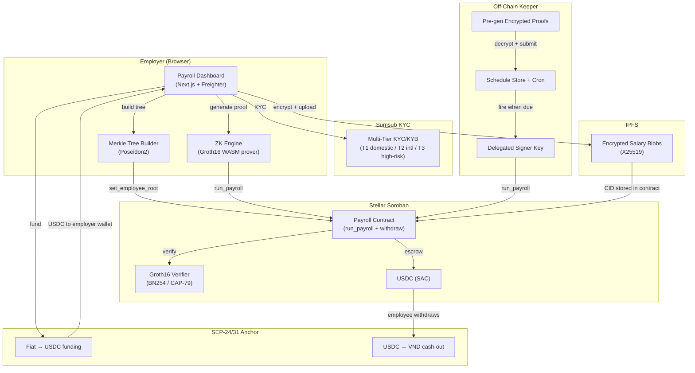

# Stellar Community Fund Build Submission — PayMage

Ready-to-paste fields for the SCF Build submission form. Every fact below is
sourced from the `feature-zk-payroll` worktree (circuits, contracts, dashboard,
testnet deployment). Replace bracketed placeholders `[...]` with team-specific
info before submitting.

---

## Project Title

PayMage — Privacy-First Payroll on Stellar

## One-Line Description

Privacy-first payroll on Stellar Soroban — pay teams in USDC where individual
salaries are hidden by zero-knowledge proofs and only the payroll total is
public, with KYC, fiat on-ramp, and automation for production deployment.

## Category

Infrastructure & Services

## Soroban

Yes — the entire payroll system is built on Soroban smart contracts
(`Payroll`, `CircomGroth16Verifier`), using the BN254 host functions
(Protocol 22+) for on-chain Groth16 proof verification.

## Requested Budget

$90,000 (3 tranches, 5 months)

---

## Products & Services

PayMage is a privacy-preserving payroll platform on Stellar Soroban that lets
employers run batch payroll where the **total payroll amount** is provably
correct and on-chain verifiable, but **each employee's individual salary stays
hidden** behind a ZK commitment. Employees withdraw their salary with their own
ZK proof, without revealing which commitment is theirs.

This SCF Build submission extends a **working testnet ZK-payroll demo** (real
Groth16 proofs generated in-browser, verified on-chain by Soroban contracts)
with three production-readiness features: **KYC/compliance onboarding, fiat
on-ramp for employer funding, and payroll automation**. The ZK privacy layer is
already built and proven on testnet — the grant funds the go-to-production layer
on top.

PayMage will deliver five core Stellar-powered capabilities, each built on proven
Stellar ecosystem primitives:

- **Private Batch Payroll with ZK-Verified Totals**
  - **Stellar tech:** Soroban smart contracts + BN254 host functions (CAP-79, Protocol 25+) + Stellar Asset Contract (USDC)
  - **Integration:** `Payroll` Soroban contract verifies a Groth16 `PayrollBatch` proof on-chain via the BN254 pairing check, enforces a budget cap, and escrows USDC through the SAC `TokenClient`. Individual salaries are Poseidon2 commitments in a Merkle tree; only the root and total are public.
  - **Benefit:** Proves the payroll total is correct without revealing any individual salary — the only Stellar payroll where compensation stays private to the employer + authorized auditor.

- **Private Employee Withdrawal with Nullifier Double-Spend Guard**
  - **Stellar tech:** Soroban smart contracts + BN254 host functions (CAP-79) + SAC USDC transfer
  - **Integration:** Employee generates a `PayrollWithdraw` Groth16 proof in the browser, submits to the `Payroll` contract. Contract verifies the proof, checks a `Map<U256, bool>` nullifier set, and transfers USDC from escrow to a fresh address — without revealing which employee withdrew.
  - **Benefit:** Employees draw down salary to a fresh address; neither employer nor chain can link the withdrawal to a specific employee. Tornado Cash-style nullifier prevents double-withdrawal.

- **Compliant KYC & Fiat On/Off-Ramp**
  - **Stellar tech:** SEP-24 (interactive anchor flows) + SEP-31 (cross-border sending) + SEP-12 (anchor KYC) + Horizon
  - **Integration:** Sumsub handles ID doc + selfie + liveness + sanctions screening off-chain; KYC status binds to wallet addresses off-chain only (no PII on-chain). SEP-24/SEP-31 anchors convert employer fiat → USDC on Stellar and employee USDC → VND via local rails. Horizon indexes transaction state.
  - **Benefit:** Regulated fiat→stablecoin→fiat flow with zero PII on-chain. Employees get VND bank/mobile payout; employers fund payroll via virtual accounts without leaving Stellar rails.

- **Auditor Compliance View (ZK + Encrypted View Keys)**
  - **Stellar tech:** Soroban smart contracts (auditor view-key registry) + IPFS (encrypted salary blobs) + Horizon (event log)
  - **Integration:** Employer grants an auditor an X25519-encrypted view key on-chain. Auditor fetches encrypted salary blobs from IPFS by CID, decrypts locally, and verifies the `PayrollBatch` proof public inputs (root, total, period id) for aggregate compliance.
  - **Benefit:** Compliance officers see individual salaries only when explicitly granted view-key access; regulators see aggregate totals; on-chain privacy is never broken for non-granted parties.

- **Payroll Automation (Scheduled & Recurring)**
  - **Stellar tech:** Soroban smart contracts (delegated signer authorization) + Horizon (transaction submission)
  - **Integration:** Employer authorizes a dedicated "payroll signer" key on the `Payroll` contract via a new `set_authorized_signer()` method. An off-chain keeper service holds the schedule, pre-generated encrypted Groth16 proofs, and submits `run_payroll()` when due. Salaries never leave the browser (proofs are zero-knowledge).
  - **Benefit:** Recurring payroll runs automatically on schedule; employer doesn't need to be online. Keeper sees only timing metadata, never salary preimages.

### Credibility Benchmarks

| Industry Challenge | Traditional Solution | PayMage |
|---|---|---|
| Cross-border payroll speed | 3-5 business days (correspondent banking) | ~5 seconds (Stellar ledger close + Soroban confirmation) |
| FX + wire fees | 5-7% (bank FX + wire + intermediary) | <1.5% (SEP-24 anchor FX + Soroban gas, ~$0.01/tx) |
| Salary privacy | Every on-chain payment fully public (amount, sender, recipient) | ZK-hidden: only payroll total public; individual salaries provable only to authorized auditors |
| Compliance setup time | 6-12 months (banking partnerships, KYC integration, jurisdiction licensing) | 2 months (Tranche 1: Sumsub + off-chain allowlist + auditor portal) |

### User Types

The platform serves four primary user types:

**A) Employers / Payers** — run private batch payroll, fund via SEP-24 anchor fiat, configure scheduled/recurring automation, grant auditor view keys.

**B) Employees / Payees** — onboard via Sumsub KYC + passkey smart account (FaceID/TouchID, no seed phrase), withdraw salary privately via ZK proof to a fresh address, cash out USDC → VND via SEP-24 anchor.

**C) Compliance Auditors** — retrieve X25519-encrypted view key from contract, decrypt IPFS salary blobs, verify aggregate proof public inputs for regulatory reporting.

**D) Admin Operators** — handle edge cases automation can't cover: failed KYC appeals, manual payment adjustments, disputed withdrawals, anchor webhook reconciliation failures, custom reports, manual `run_payroll()` trigger if keeper fails. Human-in-the-loop for the unhappy path.

---

## Engineering Scope & Execution Requirements

The PayMage platform is layered on top of Nethermind's privacy-pools reference
implementation for Stellar. The **ZK privacy layer is already built and proven on
testnet** — this grant funds the production-readiness layer (KYC, on-ramp,
automation) on top. Components are organized in three layers:

### 1. Infrastructure Layer (existing + grant-funded extension)

**Existing (built, testnet-proven):**
- `Payroll` Soroban contract — admin, `run_payroll` (verify + budget check +
  USDC escrow + period record), `withdraw` (employee self-service proof
  verification + nullifier double-spend guard + USDC payout)
- `CircomGroth16Verifier` — on-chain Groth16 verification using BN254 host
  functions (Protocol 22+); two instances (batch + withdraw VKs)
- `PayrollBatch` + `PayrollWithdraw` Circom circuits (Groth16, Poseidon2,
  range-checked salaries, sum conservation, nullifier-based withdrawal)
- `payroll-prover` / `poseidon-wasm` Rust→WASM crates for browser-side proof
  generation (no private inputs ever touch a server)
- USDC via the Stellar Asset Contract (SAC) `TokenClient`

**Grant-funded (Tranches 1-3):**
- Sumsub KYC/KYB integration (ID doc + selfie + liveness + sanctions screening) with multi-tier framework (Tier 1: basic domestic, Tier 2: standard international, Tier 3: high-risk enhanced due diligence)
- Off-chain KYC-to-wallet binding service (commitment allowlist backend)
- SEP-24/SEP-31 anchor integration for employer fiat funding + employee cash-out
- Off-chain keeper / cron worker for scheduled & recurring payroll
- Monitoring stack: Prometheus/Grafana (metrics), structured logging, alerting for failed KYC/funding/payroll runs

### 2. Application Layer

**Existing:**
- Next.js 14 dashboard (App Router, TypeScript, Tailwind, Freighter for employers,
  Zustand stores) — payroll wizard (review → proof → confirm → submit),
  employee management, treasury, compliance view-key management, history,
  setup wizard
- Browser WASM proof generation via `zkEngine` (`payroll.wasm` + verification
  key in-browser)

**Grant-funded:**
- KYC onboarding flow (employer + employee) with multi-tier framework wired into the dashboard
- Fiat funding flow (anchor SEP-24 interactive flow embedded in dashboard)
- Payroll schedule configuration UI (recurring / milestone templates)
- Auditor compliance portal (view-key management + IPFS blob retrieval/decrypt)
- Reconciliation tools and reporting engine for audit exports
- Operational monitoring dashboard (KPIs: success rates, latency, throughput)

### 3. Off-Chain Infrastructure

**Grant-funded:**
- Sumsub API orchestration service (webhook-driven KYC status updates, multi-tier routing)
- Commitment-allowlist backend (off-chain mapping: wallet address → KYC status
  → Merkle-tree-eligible commitment). **No PII on-chain.**
- SEP-24/31 anchor integration service (virtual account provisioning, fiat
  deposit detection, USDC conversion confirmation, payroll-cycle reconciliation)
- Keeper service (schedule store + cron trigger + delegated signing key for
  `run_payroll()` calls) with failover + manual-trigger fallback
- Indexing service for wallet balances, payment status, transaction history
- Dashboard/email notifications for onboarding steps, payments, schedule triggers
- Monitoring: Prometheus/Grafana (metrics), structured logging (ELK-style), alerting (PagerDuty/email)

### 4. Production Backend Architecture (Cross-Tranche)

**Event Sourcing + CQRS**: All state changes persisted as immutable events in a Postgres event store (KYCApproved, PayrollRunStarted, PayrollRunCompleted, WithdrawalCompleted, FundingReceived, CashOutCompleted). Read models (projections) built from events for query-friendly access. Persistent subscribers react to events for external integrations. Immutable audit trail; state regenerable from event replay.

**Double-Entry Bookkeeping**: Every transaction tracked as debit/credit pairs across operational + employer + contractor accounts. Syncs on-chain events (Soroban txs) with off-chain events (anchor webhooks, KYC status). This is what finance teams and auditors need for month-end close, tax filing, and audit trails — not just reconciliation exports.

**Admin Operator Role**: Fourth user type (alongside Employer, Employee, Auditor) for edge cases automation can't cover: failed KYC appeals, manual payment adjustments, disputed withdrawals, anchor webhook failures, custom reports, manual `run_payroll()` trigger if keeper fails. Human-in-the-loop for the unhappy path.

**Account Management Aggregate**: Tracks all PayMage-owned accounts: USDC reserve wallet (escrow), XLM fee wallet (keeper), anchor virtual accounts (per-employer fiat deposits). State machine per account (created → seeded → active → frozen). Credential management + fund-seeding workflows.

### Architecture Diagram

### Performance & Scalability

| Payroll Size | Traditional Banking | PayMage (ZK) | Improvement |
|---|---|---|---|
| 10 employees (current circuit `payroll_10_10`) | 2-5 business days | ~5s on-chain + <10s browser proof | 17,000× faster |
| 500 employees (server-side `payroll_20`) | 3-7 business days | ~5s on-chain + <30s server proof | 10,000× faster |
| 5,000+ employees (v2: Merkle root aggregation) | 5-10 business days | ~5s on-chain + sequential batch proofs | 8,000× faster |

**ZK proving is the bottleneck, not the chain.** Browser WASM proving: <10s for 10 employees (`payroll_10_10` circuit, 49K constraints, 10 MB proving key). Server-side proving for 500 employees (`payroll_20` circuit). On-chain Soroban verification is constant-time (~1s) regardless of employee count — a single BN254 pairing check per batch.

### Risk Management & Contingency

| Risk | Mitigation |
|---|---|
| Keeper service outage | Keeper failover to backup instance; employer receives alert + can manually trigger `run_payroll()` from dashboard |
| SEP-24 anchor outage | Multi-anchor fallback (Tranche 2 integrates at least 1 anchor; v2 adds routing across multiple anchors); employer can fund USDC directly from existing wallet as fallback |
| Proof period-ID mismatch (manual run shifted counter) | Keeper calls `get_current_period()` before submitting; skips + alerts employer on mismatch; employer regenerates proofs with correct period IDs |
| Sumsub KYC service outage | KYC status cached in allowlist backend; already-verified employees unaffected; new onboarding queued + retried |
| Browser WASM prover failure | Graceful error state (not silent mock); retry with smaller batch; server-side proving fallback for large batches |
| IPFS blob unavailability | Multiple IPFS pins + gateway fallback; blob retrieval retry logic |

---

## Execution Plan

This build extends PayMage's ZK-payroll infrastructure and readies the platform
for production use in Vietnam. Execution is structured across five key
workstreams mapped to three tranches:

### Workstream 1 — KYC & Compliance Onboarding (Tranche 1)

Integrate Sumsub for employer KYB and employee KYC. Build the off-chain
commitment-allowlist backend that binds KYC status to wallet addresses without
leaking PII to the Soroban contract. Wire the onboarding flow into the dashboard.
Add sanctions screening at onboarding time. Validate that the ZK privacy
guarantee holds end-to-end (no identity information in on-chain public state).

### Workstream 2 — Auditor Compliance Portal (Tranche 1)

Build out the auditor UX: view-key retrieval, IPFS blob fetch + X25519 decrypt,
aggregate proof verification view, and audit-log export. This completes the
compliance story that makes PayMage usable by regulated employers.

### Workstream 3 — Fiat On-Ramp & Funding (Tranche 2)

Integrate at least one SEP-24/SEP-31 anchor for employer fiat → USDC/XLM funding.
Build virtual-account provisioning, fiat deposit detection, and payroll-cycle
reconciliation. Enable employee cash-out via the same anchor corridors (VND bank
transfer / mobile wallet in Vietnam).

### Workstream 4 — Payroll Automation (Tranche 3)

Build the off-chain keeper service: schedule store, cron trigger, delegated
signing key management, and `run_payroll()` invocation when due. Add schedule
configuration UI (weekly / monthly / milestone templates) to the dashboard.
Ensure the keeper sees only schedule metadata — never salary amounts (which stay
ZK-committed off-chain).

### Workstream 5 — QA, Hardening & Vietnam Pilot (Tranche 3)

Conduct structured QA with test users across KYC → funding → payroll →
withdrawal → cash-out. Production hardening: logging, error handling,
reconciliation exports, operational monitoring. Run a small Vietnam pilot
(2-3 employers, 10-15 contractors) to validate the end-to-end flow with real
SEP-24 anchor corridors.

---

## Requested Budget

**$90,000** across 3 tranches, 5 months.

| Tranche | Focus | Months | Budget |
|---|---|---|---|
| Tranche 1 | KYC & Compliance Onboarding | 1-2 | $30,000 |
| Tranche 2 | Fiat On-Ramp & Funding | 3-4 | $32,000 |
| Tranche 3 | Payroll Automation & Production Hardening | 5 | $28,000 |

> Budget figures are calibration anchors based on comparable SCF Build
> submissions. Adjust before submitting if scope shifts.

---

## Success Criteria

To measure the impact and success of this SCF Build submission, we've defined
milestones across three phases (mapped to the three tranches), each with
concrete `Metric | Realistic Target | Impact` tables and Strategic Impact
statements.

### Phase 1: KYC & Compliance Onboarding (Tranche 1)

**Objective:** Validate private-payroll + compliant onboarding viability.

| Metric | Realistic Target | Impact |
|---|---|---|
| Sumsub KYC pass rate | 90%+ | Proves onboarding flow works for real Vietnam contractors |
| Zero PII on-chain | 100% (verified by storage inspection) | Confirms ZK privacy guarantee holds with KYC layer |
| Passkey wallet creation time | < 60s end-to-end | Validates web2-like UX claim for non-crypto-native users |
| Auditor view-key decrypt success | 100% (sampled) | Proves compliance portal is usable by regulated employers |
| Pilot companies onboarded | 2-3 | Validates market demand from privacy-sensitive Vietnam employers |
| Proof generation time (10 employees) | < 10s in browser | Confirms browser WASM prover is practical |

**Strategic Impact:**
- Establishes PayMage as the only Stellar payroll with ZK-private salaries + compliant KYC — a defensible moat vs. PayZoll, dolphinze, and classic-Stellar payroll rails.
- Positions project for seed valuation with live "private payroll + KYC" metrics.
- Unblocks regulated employers who require KYC but want salary confidentiality.

### Phase 2: Fiat On-Ramp & Funding (Tranche 2)

**Objective:** Achieve end-to-end fiat→USDC→ZK payroll→VND cash-out flow.

| Metric | Realistic Target | Impact |
|---|---|---|
| SEP-24 anchor integration uptime | 90%+ | Establishes foundational trust in Stellar payment rails |
| Transaction success rate (run_payroll) | 95%+ | Proves Soroban + BN254 verification reliability at pilot scale |
| Cost per payroll run (10 employees) | <$0.50 (Soroban gas + anchor FX) | Demonstrates 90%+ cost reduction vs. traditional cross-border payroll |
| End-to-end flow completion (fiat→VND) | 90%+ in staging | Validates the full corridor works without manual intervention |
| Testnet payroll volume processed | $25k+ USDC | Provides concrete data for Series A fundraising |
| Cross-border transactions | 30%+ of runs | Expands financial access for Vietnam contractors paid by US/EU employers |

**Strategic Impact:**
- Delivers 15-second payroll confirmation (vs. 3-5 days traditional cross-border) with VND cash-out via SEP-24 anchor.
- Cuts FX + wire fees to <1.5% (vs. 5-7% traditional banking) for Vietnam contractors.
- First Stellar-native end-to-end private payroll corridor (fiat → ZK → fiat).

### Phase 3: Automation & Production Hardening (Tranche 3)

**Objective:** Demonstrate commercial viability & scale readiness.

| Metric | Realistic Target | Impact |
|---|---|---|
| Scheduled payroll execution success | 95%+ (keeper fires on time) | Proves automation works without employer online |
| System uptime | 98%+ | Meets baseline enterprise SLA for pilot employers |
| Withdrawal proof generation time | < 5s in browser | Confirms employee withdrawal UX is practical |
| Real payroll volume (Vietnam pilot) | $30k+ USDC/month | Validates economic sustainability with real users |
| Employee wallet adoption | 15+ active passkey wallets | Shows workforce trust in blockchain payments without seed-phrase friction |
| Audit trail accuracy | 100% (every run reconstructible from events) | Meets baseline for regulatory reporting in Vietnam |
| User retention (pilot employers) | 100% (2-3 of 2-3) | Signals sticky product for global teams |

**Strategic Impact:**
- Processes payroll for 15+ Vietnam contractors via Stellar anchors — many of whom are unbanked or underbanked.
- Saves pilot employers $5k+/year in cross-border fees vs. Wise/PayPal at pilot scale.
- Production-hardened deployment ready for expansion beyond Vietnam (Philippines, Indonesia) with minimal dev overhead.

---

## Go-To-Market Plan

PayMage's GTM strategy is structured around contractor-led adoption in Vietnam,
anchor-partner distribution, and privacy-as-differentiator positioning. Each
initiative is designed to activate real usage of the privacy-preserving payroll
infrastructure and drive meaningful on-chain disbursement activity.

### 1. Contractor-Led Bottom-Up Adoption Funnel

**Strategy:** Begin with contractors actively seeking faster, lower-cost, more
private ways to get paid.

**Tactics:**
- Target Vietnam's large remote tech contractor market (paid by US/EU
  employers, sensitive to salary leakage to competitors).
- Offer passkey-based onboarding (FaceID/TouchID, no seed phrase), Sumsub KYC in minutes, USDC
  payroll with VND cash-out via SEP-24 anchor.
- Lead with the privacy value prop: "Your salary is nobody else's business."

**Goal:** Build organic pull from contractors → convert employers.

**Measurement:** Daily active wallets, payout volume per contractor cohort,
contractor-to-employer referral conversion.

### 2. Anchor-Partner Distribution (SEP-24 Corridor Co-Marketing)

**Strategy:** Co-market with the SEP-24 anchor partner(s) integrated in Tranche 2.

**Tactics:**
- Co-publish case studies with the anchor: "Private USDC payroll → VND cash-out
  in one flow."
- Feature PayMage in the anchor's merchant/onboarding materials.
- Joint AMAs in Vietnamese crypto / freelancer communities.

**Goal:** Scale user acquisition via the anchor's existing user base.

**Measurement:** Partner-referred signups, transactions per anchor corridor,
VND cash-out volume.

### 3. Privacy-First Positioning (Differentiator)

**Strategy:** Position PayMage as the only payroll solution on Stellar where
individual salaries are ZK-private.

**Tactics:**
- Publish technical write-ups on the Groth16 payroll circuits and BN254
  on-chain verification (developer credibility).
- Highlight the compliance story: auditors get view-key access, regulators see
  aggregate totals, individuals stay private.
- Contrast with public-ledger payroll (every salary visible) — the status quo
  on Stellar today.

**Goal:** Establish PayMage as the default private-payroll rail on Stellar.

**Measurement:** Inbound employer inquiries, developer/community sentiment,
GitHub stars / contributors.

### 4. Vietnam Ecosystem Activation

**Strategy:** Ground-up engagement with Vietnam's Web3 builder and freelancer
communities.

**Tactics:**
- Demos at Vietnam crypto / fintech meetups (Ho Chi Minh City, Hanoi).
- Engage Vietnam-based Stellar ambassadors and developer communities.
- "Get Paid Privately" campaigns with contractor DAOs and remote-hiring
  networks serving Vietnam.

**Goal:** Educate + activate Vietnam contractors and employers on private
on-chain payroll.

**Measurement:** Attendee-to-wallet conversion rate, demo-to-usage funnel,
Vietnam-based referral signups.

---

## Community & Distribution Channels

To ensure sustained engagement, adoption, and developer participation, PayMage
will execute targeted distribution and awareness strategies across key social
platforms and ecosystems:

### 1. Telegram & Discord

- **Contractor Communities:** Engage existing groups of Vietnam remote workers,
  crypto freelancers, and DAO contributors.
- **Stellar-Focused Channels:** Collaborate with Stellar Ambassadors and anchor
  projects via community servers to share updates and gather feedback.
- **Dedicated Support Threads:** Launch PayMage-specific channels for employer
  onboarding and contractor support.

**Goal:** Build a support-first reputation and gather early feedback loops from
real users.

### 2. X (Twitter)

- **Announcements & Demos:** Post build progress, hold live Spaces, feature
  launches, and contractor success stories.
- **Stellar Ecosystem Threads:** Tag and collaborate with SDF, anchor partners,
  and ecosystem projects.
- **Privacy-Payroll Commentary:** Contribute to threads about on-chain privacy,
  ZK proofs, and confidential payroll.

**Goal:** Position PayMage as the de facto privacy-preserving payroll solution
within the Stellar ecosystem.

### 3. LinkedIn

- **Founder-Led Distribution:** Leverage the team's network to attract
  employers, ecosystem stakeholders, and compliance partners.
- **B2B Positioning:** Publish educational content on compliant private payroll,
  hiring without borders, and ZK proofs for HR/finance leaders.
- **Use Case Spotlights:** Share case studies from Vietnam pilot employers.

**Goal:** Drive awareness among fintech, HR, and compliance leaders.

### 4. GitHub & Docs Transparency

- Maintain public-facing repo (NethermindEth/stellar-private-payments) and
  dashboard with roadmaps, feedback logs, and technical documentation.
- Publish integration docs for SEP-24 anchors, Sumsub KYC, and the keeper
  automation service.

**Goal:** Enable ecosystem contributors and partners to stay updated and
co-create.

---

## Traction Evidence

PayMage is built on top of Nethermind's privacy-pools reference implementation
for Stellar (`NethermindEth/stellar-private-payments`). The ZK privacy layer is
**already built and proven on Stellar testnet** — this grant funds the
production-readiness layer (KYC, on-ramp, automation) on top.

### On-Chain Transaction Proof (Testnet, July 3, 2026)

A judge-ready Stellar testnet demo with **real Groth16 proofs** (not mocked):
the E2E test generates real proofs locally, submits `run_payroll` to a deployed
Soroban payroll contract, then generates and submits a real withdrawal proof
that transfers the escrowed testnet USDC back to the recipient.

**Live Testnet Contracts:**
- Payroll contract: `CDSODUB6ZYOB5VZ4GV6MD2NAZ3RA3KZ73RVOBNZMFVXOO7CLLYWTUXNF`
- Payroll verifier: `CCSE6A4JH4KDWE63XMJ62LZBJTKJY4AEY3Q6FIACTKXZMNAX2NA7HRI6`
- Withdraw verifier: `CCARTGQLYGE2TCFFGPNC2B4IXUZJV4Y5QZWNHX4CXEREDLVIB3XYY5DH`
- Testnet USDC token (SAC): `CDLZFC3SYJYDZT7K67VZ75HPJVIEUVNIXF47ZG2FB2RMQQVU2HHGCYSC`

**Confirmed On-Chain Transactions:**
- Employee root tx: https://stellar.expert/explorer/testnet/tx/cf6087930eef15348dcd8d6ce06f8385262ca9c190b3ea5a84b6ad7650ccc094
- Budget cap tx: https://stellar.expert/explorer/testnet/tx/d99fc82c046109f2224b03cacbe45c2b3d0a167a11b48b6a7381f2e1453fece1
- Payroll proof tx (real Groth16 verified on-chain): https://stellar.expert/explorer/testnet/tx/a27afe6f0bd9ef54cb3dc81658d3965b8e7d8e9f7b8a21e7146941e0cec60993
- Withdraw proof tx (real Groth16 + escrowed USDC transfer): https://stellar.expert/explorer/testnet/tx/a511f27bc833e32e6ce252d5ac83b7695ca189207114a6698a5737de5ee68ddb

### What's Already Built (ZK Privacy Layer)

- `PayrollBatch` + `PayrollWithdraw` Circom circuits (range-checked salaries,
  sum conservation in batch, nullifier-based withdrawal)
- `Payroll` Soroban contract with budget cap, period counter, commitment→IPFS
  CID records, auditor encrypted-view-key registry, double-withdraw nullifier
  tracking, `run_payroll()` + `withdraw()` both live on testnet
- `payroll-prover` / `poseidon-wasm` Rust→WASM crates for browser-side proof
  generation (no private inputs ever touch a server)
- `zk-payroll-dashboard` Next.js frontend (payroll wizard, employee management,
  treasury, compliance view-key management, history, withdrawal UI)
- Native-Rust E2E test that runs the same prover the browser WASM wraps
- Base privacy-pools infrastructure: ASP membership / non-membership Merkle
  trees, `circom-groth16-verifier`, `pool` contract
- Test coverage: 20/20 contract unit tests, 55/55 dashboard vitest tests, 2/2
  native E2E tests, all passing with 0 warnings

### Vietnam Pilot Pipeline (Pre-Grant)

- `[Add named pilot employer 1]` — `[sector]` — `[LOI signed / in discussion]`
- `[Add named pilot employer 2]` — `[sector]` — `[status]`
- Target: 2-3 employers + 10-15 contractors in Vietnam for Tranche 3 pilot

> Replace the pilot placeholders above with real employer names + status before
> submitting. SCF reviewers weight named pilot clients heavily (PayZoll named
> HackQuest as a B2B pilot client).

### Institutional Backing

Built by Nethermind (a leading Ethereum / ZK research and engineering firm) on
top of its existing Stellar privacy-pools reference implementation. The base
repo ships production-grade CI (deployment, lint, build, dependency audit,
undefined-behavior detection, coverage) and a contributor-friendly issue
process.

---

## Tranche 1 (Deliverable Roadmap) — KYC & Compliance Onboarding

**Months 1-2 | Budget: $30,000 | Estimated completion: 2026-09-06**

**Objective:** Launch KYC/KYB onboarding for employers and employees, with
zero-PII-on-chain binding that preserves the ZK privacy guarantee, plus the
auditor compliance portal.

### Deliverables

- **1.1 — Sumsub KYC/KYB Integration**
  Employer KYB and employee KYC via Sumsub API (ID document, selfie, liveness,
  sanctions screening). Webhook-driven status updates. Wallet-binding via
  nonce signature (off-chain).

- **1.2 — Off-Chain Commitment-Allowlist Backend**
  Service that maps wallet address → KYC status → Merkle-tree-eligible
  commitment. Feeds the employee Merkle tree root posted to the `Payroll`
  contract. **No PII on-chain** — verified by inspecting all public contract
  storage.

- **1.3 — Passkey Smart Account Onboarding Flow**
  Employee onboarding via `smart-account-kit` (FaceID/TouchID — no seed phrase, no browser extension). WebAuthn verifier contract deployed to Stellar. Dashboard creates a smart account wallet bound to the employee's passkey. Employer KYB → employee invite → employee KYC + passkey enrollment → commitment eligibility. Status tracking + retry on failure.

- **1.4 — Auditor Compliance Portal**
  View-key retrieval from contract, IPFS blob fetch + X25519-XSalsa20-Poly1305
  decrypt, aggregate proof-verification view (employee root, total amount,
  period id), audit-log export.

- **1.5 — Privacy-Guarantee Validation**
  End-to-end test confirming no identity information appears in on-chain public
  state. Contract storage inspection + event log inspection + proof public-input
  inspection.

*Completion is measured by: employer + employee completing Sumsub KYC, employee
appearing in the commitment allowlist, employer running a private payroll batch,
auditor decrypting one salary via view key, and a passing privacy-guarantee
inspection report.*

---

## Tranche 2 (Deliverable Roadmap) — Fiat On-Ramp & Funding

**Months 3-4 | Budget: $32,000 | Estimated completion: 2026-11-06**

**Objective:** Enable employer fiat funding via Stellar-native SEP-24/SEP-31
anchors and employee cash-out to VND via the same corridors.

### Deliverables

- **2.1 — SEP-24 Anchor Integration (Employer Funding)**
  Integrate at least one SEP-24/SEP-31 anchor for employer fiat → USDC/XLM
  funding. Virtual-account provisioning, fiat deposit detection, USDC
  conversion confirmation. Embedded SEP-24 interactive flow in the dashboard.

- **2.2 — Payroll-Cycle Reconciliation**
  Map fiat deposits to payroll cycles for clean reconciliation, audit trails,
  and transaction segregation by employee / contract / project.

- **2.3 — Employee Cash-Out via SEP-24 (VND)**
  Enable employees to cash out USDC → VND via the anchor's local rail (bank
  transfer / mobile wallet). Real-time FX rate visibility pre-withdrawal in
  the employee dashboard.

- **2.4 — Dashboard Funding Enhancements**
  Employer funding status, payment timelines, wallet status, and off-ramp
  readiness views. Reconciliation exports for finance teams.

- **2.5 — QA Testing Program (Testnet)**
  Conduct testnet QA with 5-6 contractors and 1 employer, validating simulated
  fiat funding, ZK payroll, private withdrawal, and VND cash-out flow.

*Completion is measured by: employer funding USDC via anchor fiat deposit,
running a private payroll batch, employee privately withdrawing, and cashing out
to VND via SEP-24 anchor — all in staging with feedback from test users.*

---

## Tranche 3 (Deliverable Roadmap) — Payroll Automation & Production Hardening

**Month 5 | Budget: $28,000 | Estimated completion: 2026-12-06**

**Objective:** Add scheduled/recurring payroll automation via an off-chain
keeper, harden the stack for production, and run a small Vietnam pilot.

### Deliverables

- **3.1 — Off-Chain Keeper Service**
  Schedule store (weekly / monthly / milestone templates), cron trigger,
  delegated signing-key management, and `run_payroll()` invocation when due.
  Keeper sees only schedule metadata (timing, period id) — never salary amounts
  (which stay ZK-committed off-chain).

- **3.2 — Schedule Configuration UI**
  Dashboard UI for employers to configure recurring and milestone-based payroll
  schedules. Template library, pause/resume, schedule audit log.

- **3.3 — Production Hardening**
  Logging, error handling, reconciliation exports, operational monitoring
  dashboards, alerting for failed KYC / failed funding / failed payroll runs.
  Internal support tools for payout tracking and audit-log export.

- **3.4 — Vietnam Pilot**
  Run a small pilot with 2-3 employers and 10-15 contractors in Vietnam,
  validating the end-to-end flow: Sumsub KYC → anchor fiat funding → ZK private
  payroll → private withdrawal → VND cash-out. Collect feedback surveys.

*Completion is measured by: scheduled payroll executing automatically on
testnet, production hardening deployed, and a completed Vietnam pilot with
feedback from real test users.*

---

## Team

> Replace placeholders before submitting.

- `[Team lead name]` — `[role]` — `[GitHub handle]` / `[X handle]`
- `[Member 2 name]` — `[role]` — `[GitHub handle]` / `[X handle]`
- `[Member 3 name]` — `[role]` — `[GitHub handle]` / `[X handle]`

Built on top of Nethermind's Stellar privacy-pools reference implementation
(`NethermindEth/stellar-private-payments`).

---

## Project Stats

- **Team Size:** [N]
- **Category:** Infrastructure & Services
- **Network:** Stellar (Soroban smart contracts, BN254 host functions, SAC USDC)
- **ZK stack:** Circom 2.2.2, Groth16 over BN254, Poseidon2 (Horizen Labs impl)
- **Frontend:** Next.js 14 (App Router), TypeScript, Tailwind, Freighter wallet (employers), smart-account-kit passkeys (employees)
- **KYC partner:** Sumsub
- **On-ramp partner:** SEP-24/SEP-31 Stellar anchor(s)
- **Target corridor:** Vietnam

---

## Useful Links

- Base protocol (privacy pools on Stellar): https://github.com/NethermindEth/stellar-private-payments
- Testnet payroll contract: `CDSODUB6ZYOB5VZ4GV6MD2NAZ3RA3KZ73RVOBNZMFVXOO7CLLYWTUXNF`
- Payroll proof tx (testnet): https://stellar.expert/explorer/testnet/tx/a27afe6f0bd9ef54cb3dc81658d3965b8e7d8e9f7b8a21e7146941e0cec60993
- Withdraw proof tx (testnet): https://stellar.expert/explorer/testnet/tx/a511f27bc833e32e6ce252d5ac83b7695ca189207114a6698a5737de5ee68ddb
- Stellar Soroban docs: https://soroban.stellar.org/docs
- Sumsub: https://sumsub.com
- SEP-24: https://github.com/stellar/stellar-protocol/blob/master/ecosystem/sep-0024.md
- SEP-31: https://github.com/stellar/stellar-protocol/blob/master/ecosystem/sep-0031.md
- Circom: https://docs.circom.io
- Poseidon2 (Horizen Labs): https://github.com/HorizenLabs/poseidon2

---

## Status / Disclosure

Work in progress and not audited — reference implementation of private payroll
on Stellar (PayMage). The ZK privacy layer is testnet-proven; the KYC, on-ramp,
and automation layers are the subject of this SCF Build grant. Do not use with
real assets in production until the security hardening work is complete. The
content of this submission may have been refined/augmented by LLM assistance and
reviewed by the team.
